# Anomalous Data Collection — Progress Report

---

## 1. Overview

We collected two anomaly datasets using our srsRAN 5G NR telemetry pipeline, which instruments a gNB with approximately 60 eBPF hooks (jBPF) producing 17 telemetry schemas at 1 ms granularity. A ZMQ channel broker — either a lightweight C broker or a GNU Radio Companion (GRC) Python broker — injects calibrated channel impairments between the gNB and a software UE (srsUE).

The two datasets target orthogonal anomaly sources:

1. **Stress anomaly dataset** (25 March 2026): 23 system-level scenarios injecting CPU, memory, scheduler, and traffic stressors into the gNB host while the radio channel remains constant. Purpose: isolate infrastructure faults from channel degradation.

2. **Realistic channel dataset** (1–2 April 2026): 12 channel scenarios covering indoor LoS baselines, vehicular drive-by, cell-edge interference, deep fading, and radio link failure cycles. Purpose: capture the full range of channel-induced MAC-layer degradation observable in the srsUE ZMQ stack.

Together, the datasets contain 30 unique scenario configurations (23 stress + 7 channel with full MAC data) plus 5 additional channel scenarios where only hook-latency telemetry was produced.

---

## 2. Infrastructure Anomalies (Stress Dataset)

**Dataset location:** `~/Desktop/dataset/stress_20260325_204950/`  
**Baseline configuration:** Rician fading, K=3 dB, SNR=25 dB, fd=5 Hz (C broker)  
**Collection per scenario:** 25 s settle, 180 s capture, 10 s cooldown

### 2.1 Scenario Design

The 23 scenarios span five categories. Each category targets a distinct component of the gNB software stack and was designed to test a specific hypothesis about what can and cannot be detected via internal telemetry.

---

### 2.2 CPU Stressors (Scenarios 01–06) — No anomaly

These scenarios saturate the host CPU with standard benchmarking tools (`stress-ng`, `cpulimit`) to simulate noisy-neighbour workloads: competing VM tenants, runaway system processes, or cache-intensive co-located network functions.

| ID | Label | FAPI-UL max | BSR max | SINR |
|----|-------|-------------|---------|------|
| 00 | baseline_clean | 70.7 µs | 2096 KB | 25.4 dB |
| 01 | cpu_pinned_50pct | 60.6 µs (0.86×) | 2128 KB (1.02×) | 25.3 dB |
| 02 | cpu_pinned_80pct | 37.2 µs (0.53×) | 2198 KB (1.05×) | 25.2 dB |
| 03 | cpu_pinned_95pct | 32.7 µs (0.46×) | 2343 KB (1.12×) | 25.0 dB |
| 04 | cpu_cpulimit_600 | 57.5 µs (0.81×) | 2079 KB (0.99×) | 25.3 dB |
| 05 | cpu_cpulimit_300 | 63.2 µs (0.89×) | 2035 KB (0.97×) | 25.1 dB |
| 06 | cpu_rt_preempt | 38.2 µs (0.54×) | 2438 KB (1.16×) | 24.7 dB |

**Scenario descriptions:**

- **01 cpu_pinned_50pct** — `stress-ng --cpu N` at 50% of available cores, pinned to the same NUMA node as the gNB. Simulates moderate background load from co-located services.
- **02 cpu_pinned_80pct** — Same as above at 80% saturation. Enough to starve most normal-priority processes.
- **03 cpu_pinned_95pct** — Near-total CPU saturation, leaving only ~5% headroom for the OS scheduler. The gNB's real-time threads remain unaffected.
- **04 cpu_cpulimit_600** — `cpulimit` caps the gNB process to 600% CPU (6 full cores). Simulates a container CPU quota that allows generous but not unlimited utilisation.
- **05 cpu_cpulimit_300** — Same but capped to 300% (3 cores). Tight quota, equivalent to a resource-constrained container deployment.
- **06 cpu_rt_preempt** — A real-time competitor (`chrt -f 50`) runs at priority 50 — below the gNB's SCHED_FIFO:96 but above all normal processes. Tests whether any RT-class competition affects the gNB.

**What happened:** None of these produced any measurable anomaly. Hook latency actually decreased in several runs (likely due to cache warming from the stressor filling cache lines). The key reason: the gNB runs its MAC/FAPI scheduling threads at `SCHED_FIFO` priority 96. Under Linux, no `SCHED_OTHER` or `SCHED_BATCH` task can preempt a `SCHED_FIFO:96` thread, regardless of how many such tasks exist. The gNB is, by design, immune to CPU contention from co-located workloads at normal priority.

**Implication:** A 5G gNB with proper RT scheduling cannot be disrupted by noisy neighbours. CPU saturation anomaly detection via hook latency requires a direct attack on the scheduler priority itself.

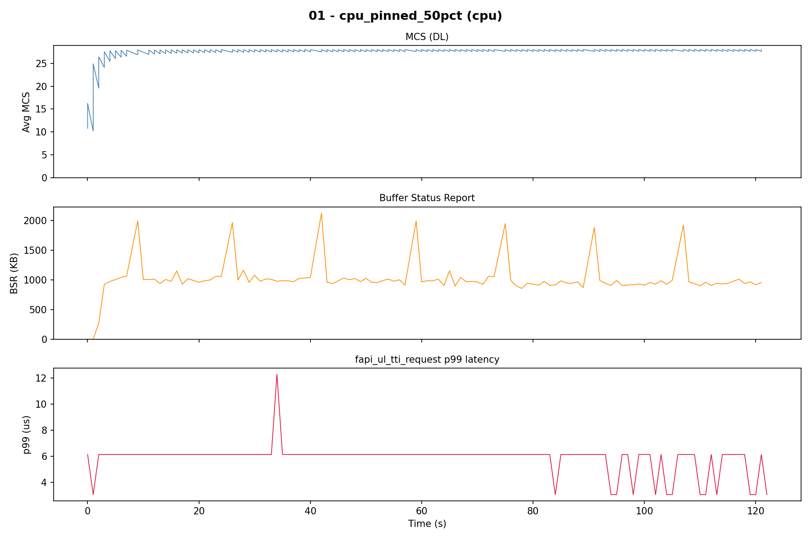
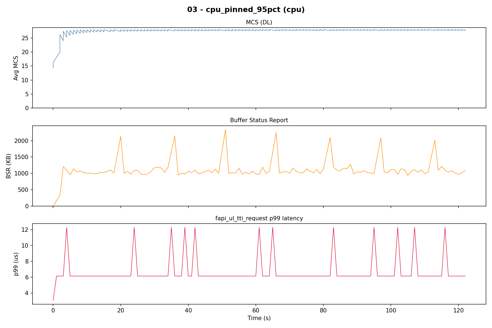

---

### 2.3 Memory Pressure (Scenarios 07–10) — Weak to moderate

These scenarios consume host RAM to simulate a gNB running low on available memory — due to a memory leak in another process, a large ML model loaded alongside the gNB, or an orchestrator that over-committed the node's memory.

| ID | Label | FAPI-UL max | BSR max | SINR |
|----|-------|-------------|---------|------|
| 07 | mem_80pct_rss | 49.7 µs (0.70×) | 2549 KB (1.22×) | 24.7 dB |
| 08 | mem_60pct_rss | 76.8 µs (1.09×) | 2732 KB (1.30×) | 24.7 dB |
| 09 | mem_40pct_rss | 50.3 µs (0.71×) | 2812 KB (1.34×) | 24.6 dB |
| 10 | mem_40pct_balloon | 69.8 µs (0.99×) | **9570 KB (4.57×)** | 23.6 dB |

**Scenario descriptions:**

- **07 mem_80pct_rss** — Allocates memory until the gNB's RSS reaches 80% of physical RAM. Forces the kernel to reclaim pages from other processes.
- **08 mem_60pct_rss** — RSS pressure at 60% of physical RAM. Less aggressive than 07 but enough to trigger occasional kernel page reclaim.
- **09 mem_40pct_rss** — RSS pressure at 40% of physical RAM. Mild memory constraint; tests the lower boundary of observable effects.
- **10 mem_40pct_balloon** — A system-wide memory balloon (not just the gNB's RSS) consumes 40% of RAM. This evicts pages from all processes, including iperf3's socket buffers and the UE. The effect is more severe than gNB-local RSS pressure.

**What happened:** Scenarios 07–09 produced weak 1.2–1.3× BSR increases — within the range of ordinary fading variation and not useful as a discriminating anomaly signal. Scenario 10 (the system-wide balloon) was more visible: BSR spiked 4.6× and SINR dropped 1.8 dB as iperf3's socket buffers were evicted. Still, this pattern overlaps with moderate channel degradation and cannot be cleanly attributed to memory pressure from telemetry alone.

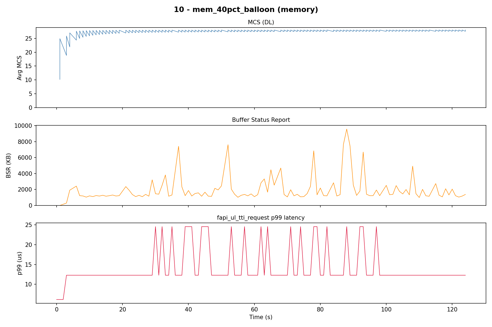

---

### 2.4 Scheduler Attacks (Scenarios 11–14) — Strong and unique

These scenarios directly manipulate the gNB's OS scheduling priority — the only class of stressor that can override the RT priority shield.

| ID | Label | FAPI-UL max | BSR max | SINR |
|----|-------|-------------|---------|------|
| 11 | sched_rt_competitor_97 | 57.2 µs (0.81×) | 7043 KB (3.36×) | 23.7 dB |
| **12** | **sched_demote_rt_batch** | **7288.6 µs (103×)** | 6478 KB (3.09×) | 23.9 dB |
| **13** | **sched_demote_rt_other** | **3617.3 µs (51×)** | 7565 KB (3.61×) | 23.8 dB |
| **14** | **sched_demote_rt_plus_cpu** | **2911.3 µs (41×)** | 16050 KB (7.66×) | 23.4 dB |

**Scenario descriptions:**

- **11 sched_rt_competitor_97** — Launches a competing `SCHED_FIFO:97` thread (one priority level *above* the gNB) that yields regularly. Tests whether any RT preemption is observable without actually demoting the gNB. The gNB threads continue running but the competing thread takes brief time slices, causing occasional BSR accumulation (3.4×) with no hook latency effect.
- **12 sched_demote_rt_batch** — Uses `chrt` and `taskset` to change the gNB's scheduling policy from `SCHED_FIFO:96` to `SCHED_BATCH`. SCHED_BATCH threads are treated as bulk/non-interactive workloads — they are regularly preempted by normal CFS threads. This is the most severe scheduler attack: hook latency reaches **7.3 ms (103× baseline)**. Simulates a misconfigured container runtime that forgets to apply `CAP_SYS_NICE` or a deployment manifest error.
- **13 sched_demote_rt_other** — Demotes the gNB to `SCHED_OTHER` (standard CFS scheduling, priority 0). Less severe than SCHED_BATCH: 51× hook latency spike. Simulates a privilege-drop attack or a container breakout that modifies thread scheduling via `/proc/pid/sched`.
- **14 sched_demote_rt_plus_cpu** — Combines SCHED_OTHER demotion with 80% CPU load. The CPU stressor amplifies the scheduler demotion effect: 41× hook latency and 7.7× BSR spike. Simulates a compound failure (misconfiguration + resource contention).

**What happened:** The most dramatic anomaly in the entire dataset. The FAPI-UL hook records the time between successive slot timer callbacks in the MAC scheduler. When those threads are deprioritised, the scheduling loop stalls mid-slot; the hook records the full stall duration. Critically, **SINR stays at ~24 dB and MCS at ~28** — the radio channel is completely unaffected. This is a pure software execution anomaly invisible to any radio metric or E2SM-KPM counter.

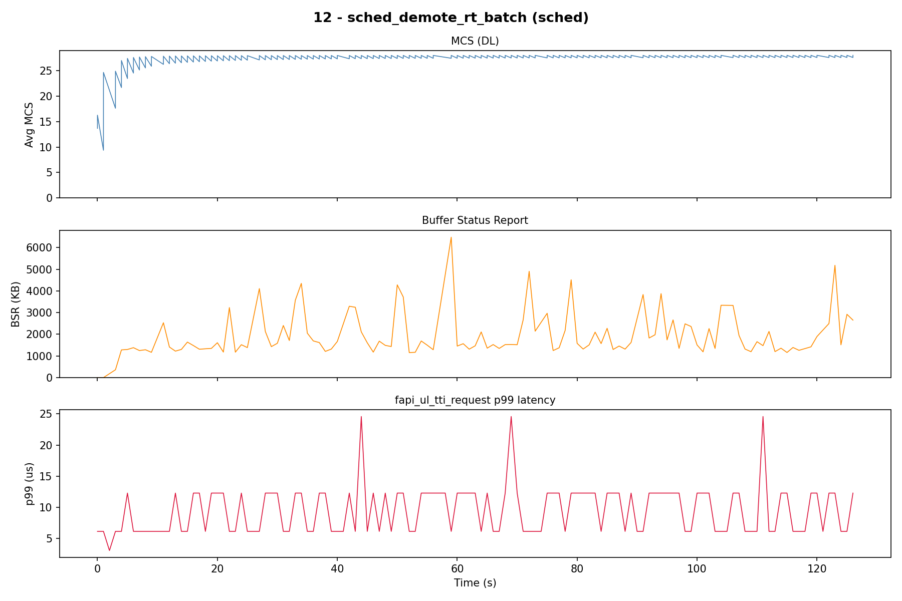
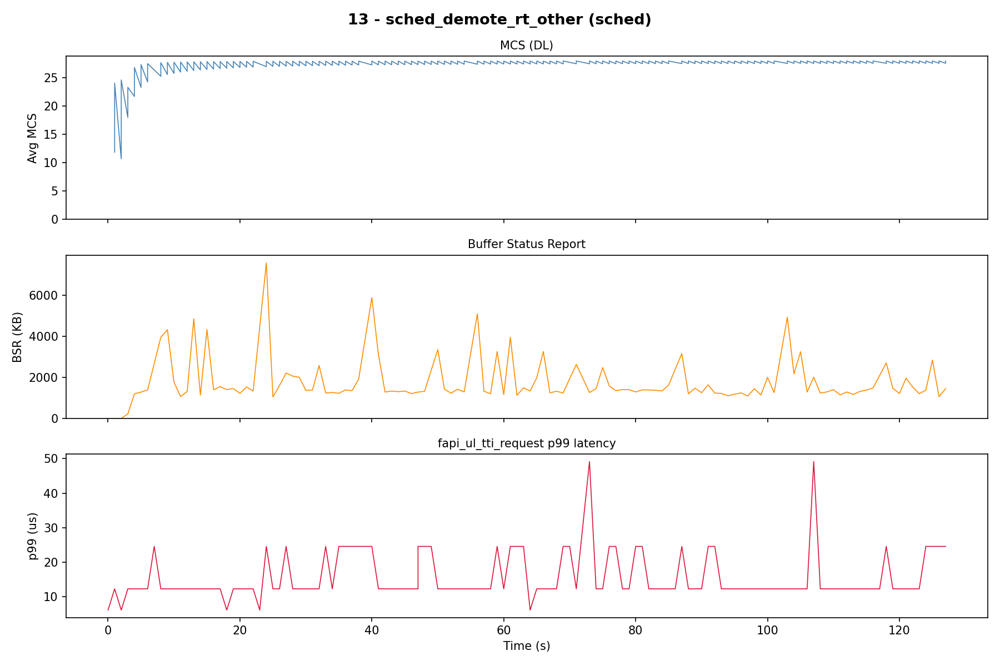
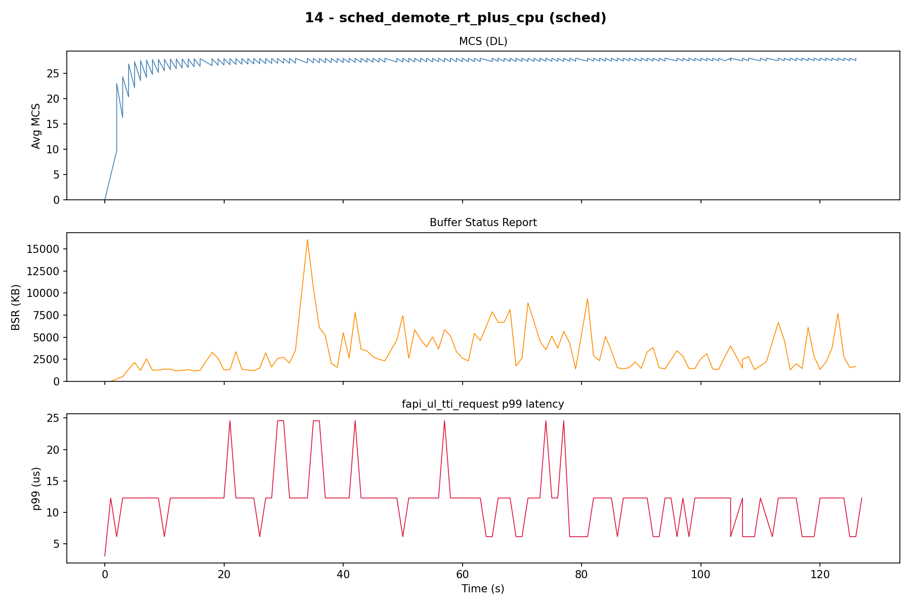

---

### 2.5 Traffic Flooding (Scenarios 15–19) — Strong BSR signal, unique

These scenarios inject network traffic that exceeds the UL radio capacity, forcing the MAC scheduler's buffer to back up.

| ID | Label | FAPI-UL max | BSR max | SINR | MCS |
|----|-------|-------------|---------|------|-----|
| **15** | **traffic_flood_100m** | 61.9 µs (0.88×) | **32129 KB (15.3×)** | 23.3 dB | 28.0 |
| **16** | **traffic_flood_150m** | 42.3 µs (0.60×) | **32813 KB (15.7×)** | 23.3 dB | 27.9 |
| **17** | **traffic_netem_delay** | 50.8 µs (0.72×) | **25977 KB (12.4×)** | 23.3 dB | 28.0 |
| 18 | traffic_burst_aggressive | 94.6 µs (1.34×) | **31445 KB (15.0×)** | 23.4 dB | 27.8 |
| **19** | **traffic_netem_burst** | 92.0 µs (1.30×) | **26458 KB (12.6×)** | 23.5 dB | 28.0 |

**Scenario descriptions:**

- **15 traffic_flood_100m** — `iperf3` injects 100 Mbps of background UDP traffic on the UL interface, saturating the radio link (which has ~30–40 Mbps physical capacity at MCS 28). BSR climbs to 32 MB as packets queue faster than the scheduler can drain them.
- **16 traffic_flood_150m** — Same as 15 but at 150 Mbps. The additional 50 Mbps is immediately discarded because the queue is already saturated; the BSR profile is nearly identical (32.8 MB), confirming the queue reached its ceiling.
- **17 traffic_netem_delay** — Uses `tc netem` to add 20 ms artificial delay to all packets, combined with 50 Mbps background load. The delay forces TCP retransmissions and ACK hold-ups, inflating BSR through congestion window effects rather than raw throughput.
- **18 traffic_burst_aggressive** — Short aggressive UDP bursts (8 bursts × 1 Gbps for 50 ms each, spaced 5 s apart). The hook latency shows minor spikes (1.34×) during burst onset as the scheduler's batch allocator handles a sudden queue transition.
- **19 traffic_netem_burst** — Periodic bursts via `tc netem` with correlated loss + delay. Produces BSR spikes at burst boundaries; the periodic pattern is distinguishable from steady-state flooding (17) or random bursts (18).

**What happened:** BSR grows to 25–33 MB (12–16×) while SINR and MCS remain at maximum values. The MAC scheduler correctly allocates all available PRBs every slot but cannot drain the queue faster than data arrives. Zero HARQ failures throughout. **This is the distinguishing signature**: with the GRC broker, elevated BSR always co-occurs with SINR drop and MCS reduction. Here BSR spikes in complete isolation — a clean two-class separation that allows a classifier to distinguish traffic flooding from channel degradation.

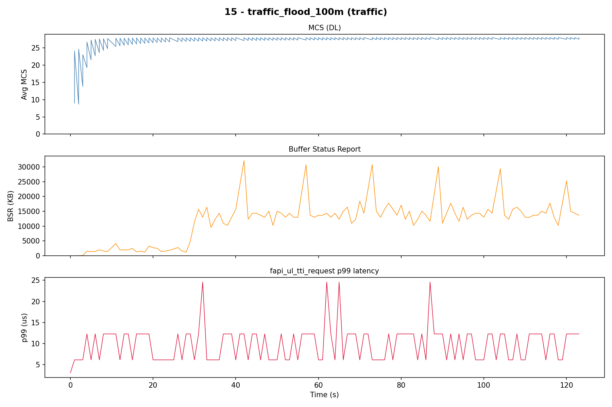
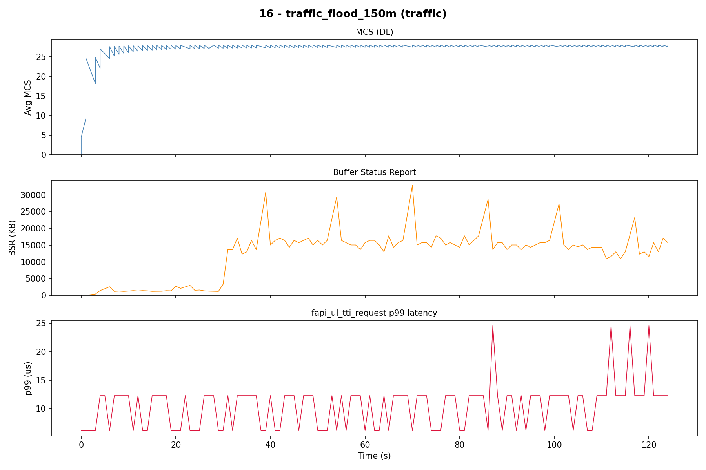
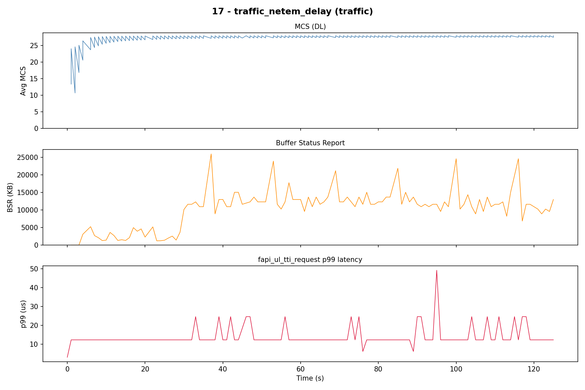
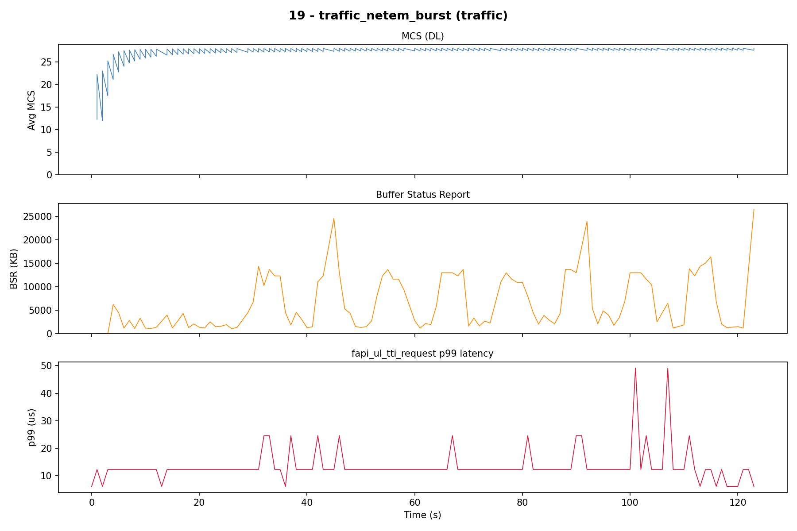

---

### 2.6 Combined Stressors (Scenarios 20–22)

These scenarios combine two stressor types simultaneously to produce compound failure signatures.

| ID | Label | FAPI-UL max | BSR max | SINR |
|----|-------|-------------|---------|------|
| 20 | combined_rt_preempt_traffic | 25.7 µs (0.36×) | **35547 KB (17.0×)** | 23.4 dB |
| 21 | combined_cpulimit_mem | 40.2 µs (0.57×) | 7944 KB (3.79×) | 24.2 dB |
| **22** | **combined_demote_traffic** | **2429.5 µs (34×)** | **38386 KB (18.3×)** | 23.3 dB |

**Scenario descriptions:**

- **20 combined_rt_preempt_traffic** — Combines `SCHED_FIFO:97` competition (scenario 11) with 100 Mbps traffic flood. The RT competitor has no effect on hook latency (same result as 11 alone) but the traffic flood pushes BSR to 17× baseline. The combination does not create a new signature; it is the sum of its parts.
- **21 combined_cpulimit_mem** — CPU quota limit (300%) combined with system-wide memory pressure. Neither component alone produces a strong anomaly, and their combination produces only a moderate 3.8× BSR spike and marginal SINR drop. The two stressors interact weakly because the CPU limit does not affect RT threads and the memory pressure primarily affects iperf3 buffers.
- **22 combined_demote_traffic** — Scheduler demotion (SCHED_BATCH) combined with 100 Mbps traffic flood. This produces a **two-dimensional anomaly**: hook latency 34× AND BSR 18× simultaneously. Neither stressor alone produces this joint pattern. This is the most realistic compound scenario: a scheduling misconfiguration (deployment error or privilege escalation) occurring at the same time as a traffic burst. A root-cause-attribution classifier can decompose this into its two components using the orthogonality of the two signals.

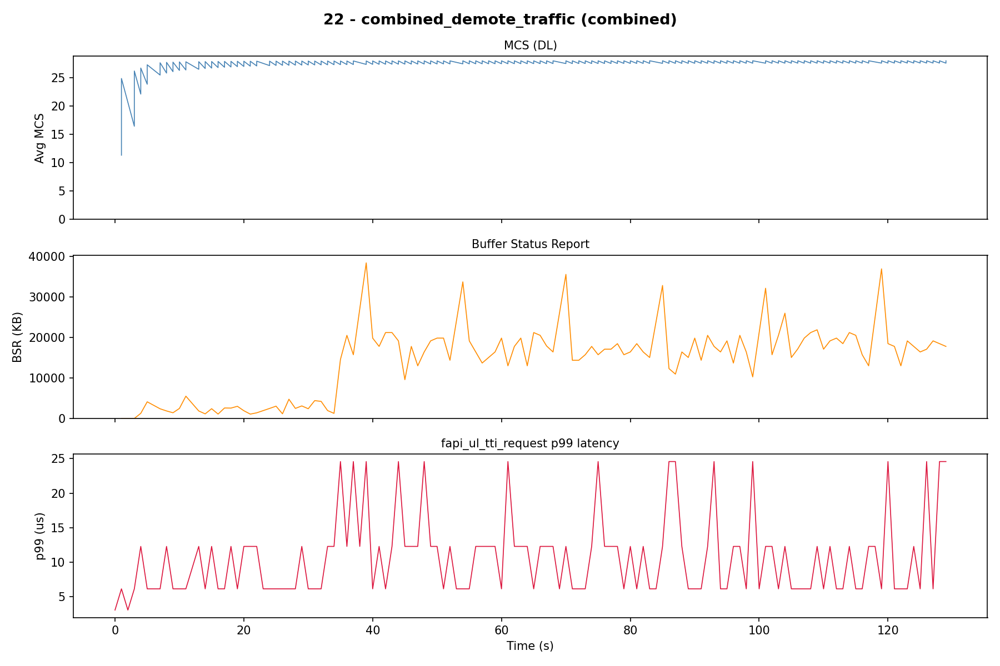

---

### 2.7 Stress Dataset Summary

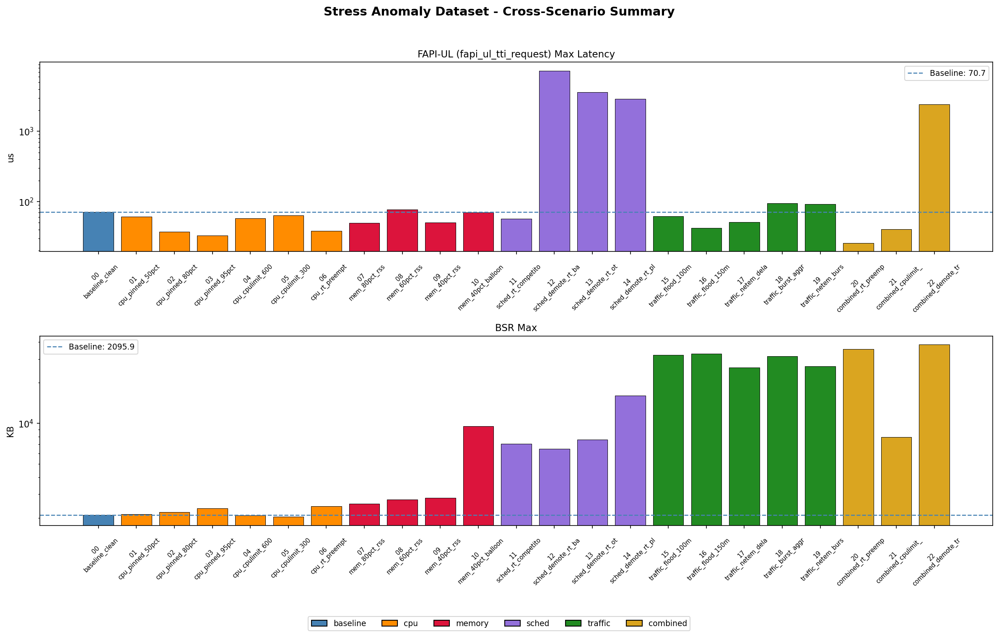

| Scenario class | Hook anomaly | BSR anomaly | Unique vs GRC broker |
|---|---|---|---|
| CPU stressors (01–06) | None | None | No |
| Memory RSS (07–09) | None | Weak 1.2–1.3× | No |
| Memory balloon (10) | None | Moderate 4.6× | Partial |
| Sched RT competitor (11) | None | Moderate 3.4× | Partial |
| **Sched demote (12–14)** | **41–103×** | Moderate | **Yes** |
| **Traffic flood (15–19)** | None | **12–16×** | **Yes** |
| Combined preempt+traffic (20) | None | **17×** | **Yes** |
| Combined cpulimit+mem (21) | None | Moderate | No |
| **Combined demote+traffic (22)** | **34×** | **18×** | **Yes** |

**14 of 23 scenarios** produce anomaly signals not replicable with the GRC channel broker.

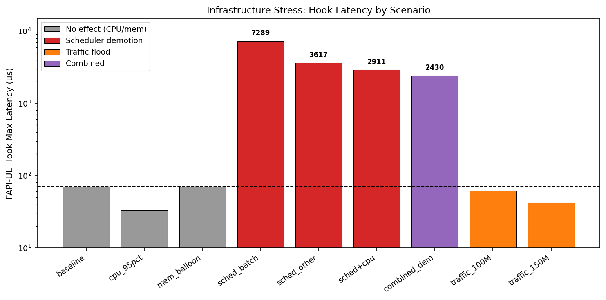

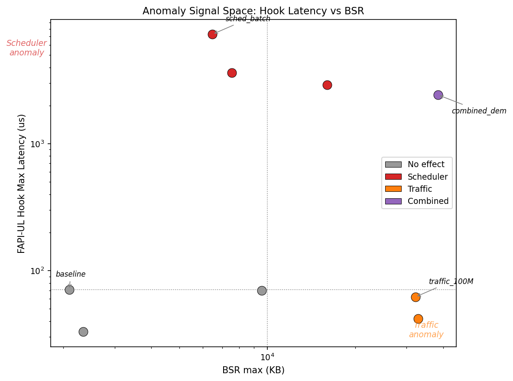

---

## 3. Channel Anomalies (Realistic Channel Dataset)

**Dataset location:** `~/Desktop/channel_dataset/20260401_180521/`  
**Broker:** GRC Python broker (`srsran_channel_broker.py`) with frequency-selective fading  
**UL channel:** Flat Rician (K=6, SNR=25) for all scenarios to maintain PUCCH stability

### 3.1 Scenario Design

We designed 12 scenarios across four categories:

- **Baseline (B1, B2):** Clean indoor LoS and pedestrian NLoS
- **Time-varying (T1–T5):** Drive-by fading, urban walk, edge-of-cell decline
- **Steady impairment (S1–S3):** Cell-edge with CW interference, Rayleigh deep fade, high-speed train
- **RLF cycles (L1, L2):** Periodic signal blackout causing radio link failure and recovery

### 3.2 Results: 7 Scenarios with Full MAC Data

| Scenario | Config | MCS avg | BSR max (MB) | RLC delay max (ms) | HARQ fail/s |
|---|---|---|---|---|---|
| B1 | Rician K=6 SNR=25 fd=2 Hz | 27.6 | 1.99 | 37 | 0.00 |
| B2 | EPA SNR=22 fd=5 Hz NLoS | 15.7 | 6.53 | 1853 | 4.14 |
| T1 | EPA SNR=20-12 drive-by, 25M load | 11.6 | 61.6 | 1229 | 1.02 |
| T2 | EPA SNR=25 drive-by + CW SIR=15 | 12.0 | 0.004 | 13 | 0.64 |
| S1 | EPA SNR=20 CW SIR=15, 20M load | 22.0 | 37.6 | 1856 | 2.93 |
| S2 | Rayleigh SNR=28 fd=5 Hz | 27.6 | 2.01 | 43 | 0.00 |
| L1 | Rician K=6 SNR=25 4s blackout/90s | 27.5 | 12.95 | 4072 | 1.46 |

The scenarios produce clearly differentiated telemetry signatures:

- **B1 and S2** represent clean channels (high MCS, low BSR, near-zero HARQ failures). S2 uses Rayleigh fading at high SNR, which behaves similarly to Rician at this SNR level.
- **B2 and S1** show moderate-to-severe degradation with elevated HARQ failures (2.9–4.1/s) and RLC delays exceeding 1.8 s. These represent sustained poor-channel conditions.
- **T1** is the most extreme buffering case: the drive-by scenario with 25 Mbps offered load against a link whose effective capacity drops below 5 Mbps at the SNR trough, producing 61.6 MB peak BSR.
- **T2** shows anomalously low BSR (0.004 MB) because the UE crashed before the iperf3 traffic generator ramped up. The scenario is retained for its HARQ and MCS data.
- **L1** produces the highest RLC delay (4.07 s) due to the 4-second signal blackout: the RLC queue accumulates data during each blackout, then drains during recovery. This is the only scenario exhibiting periodic complete disruption followed by recovery.

### 3.3 Per-Scenario Plots

#### Collected 1 April 2026 (B1, B2, T2, S2, L1)

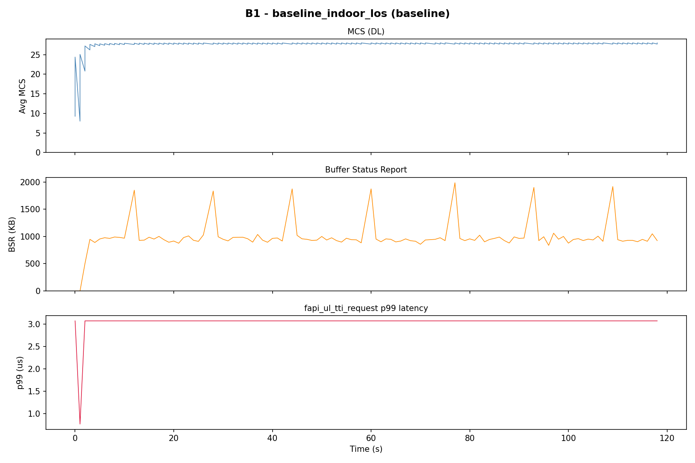
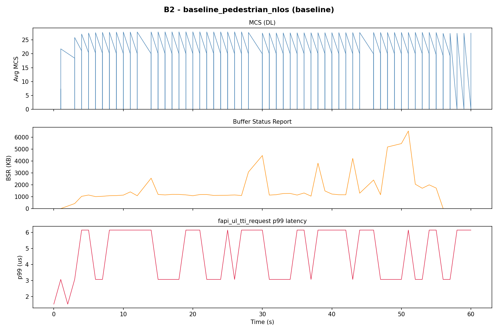
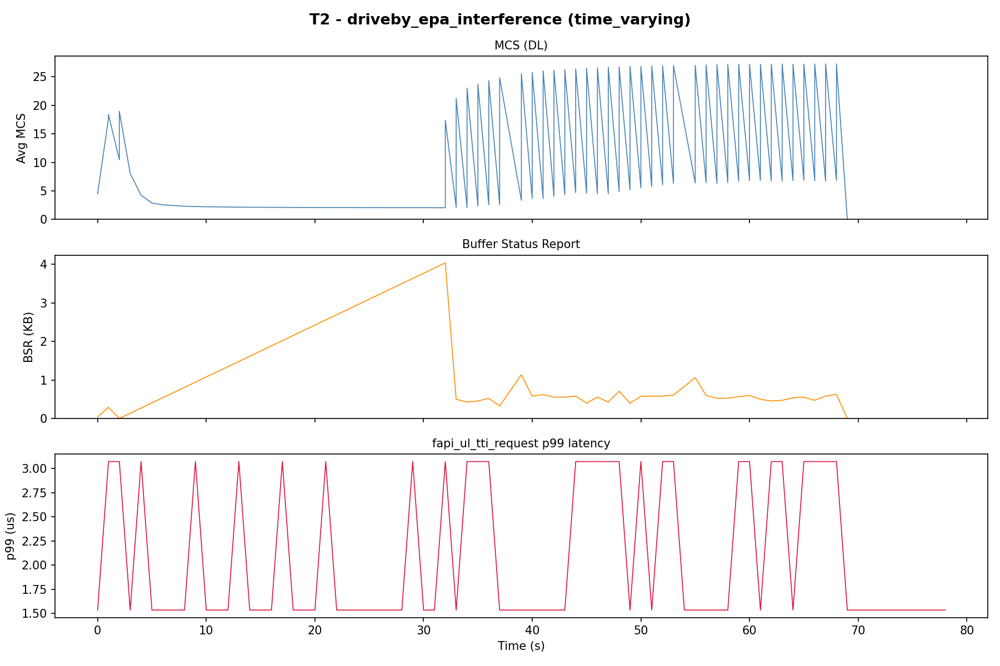
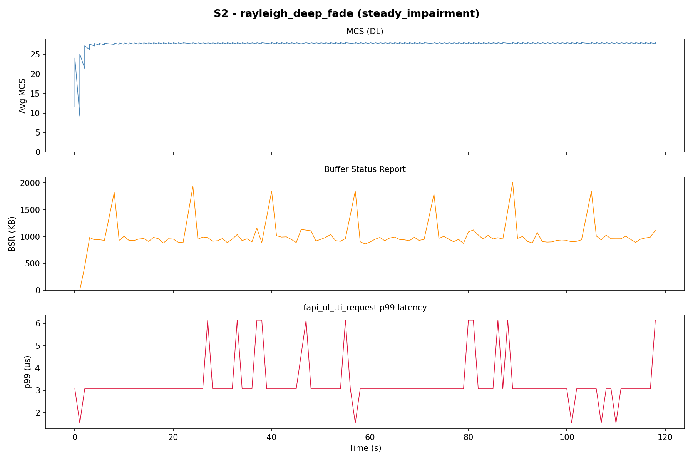
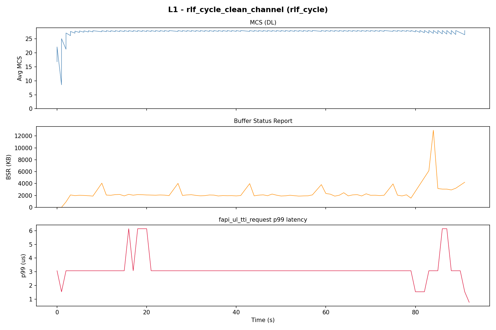

#### Collected 2 April 2026 (T1, T3, T4, T5, S1, S3, L2)

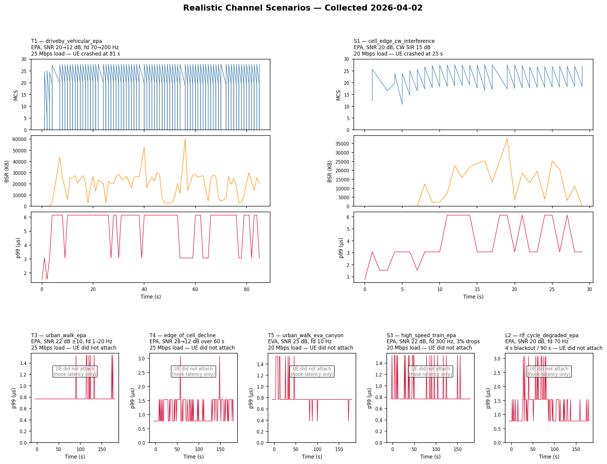

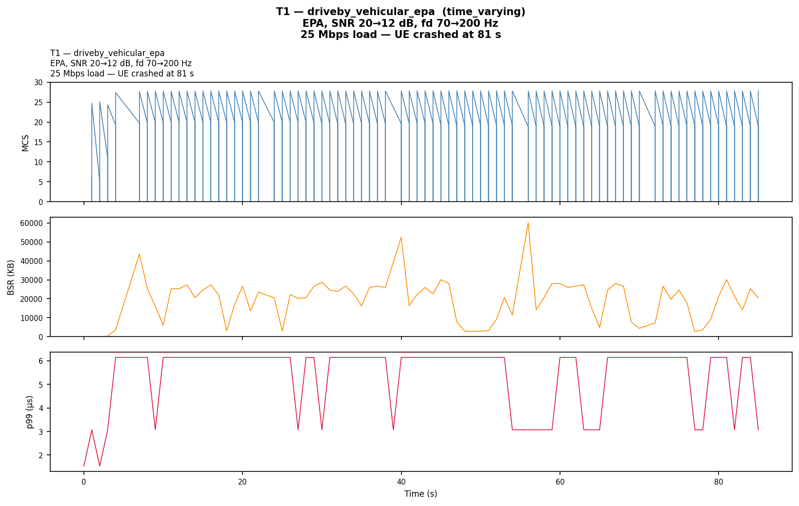
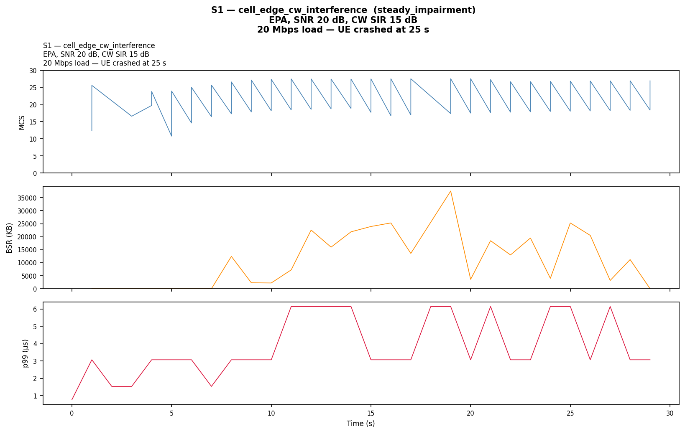
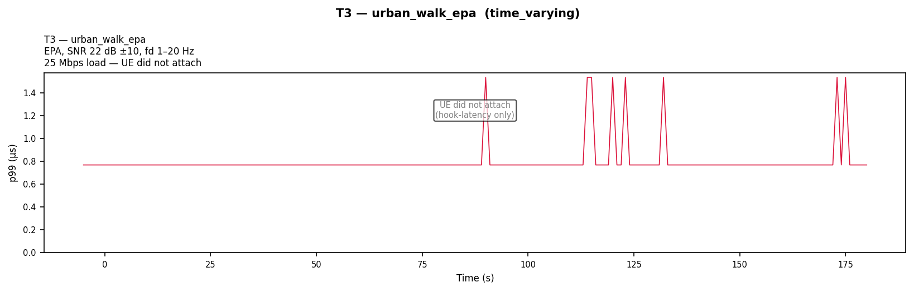
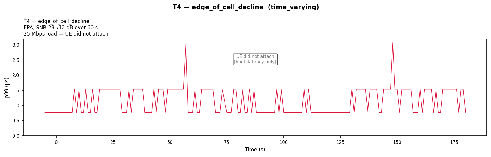
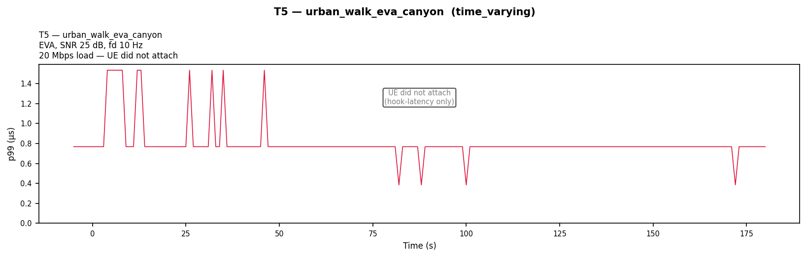
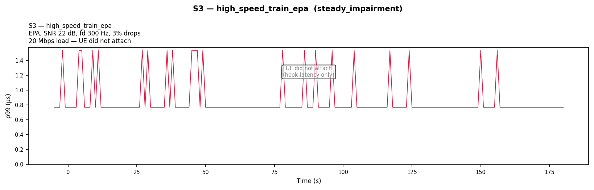
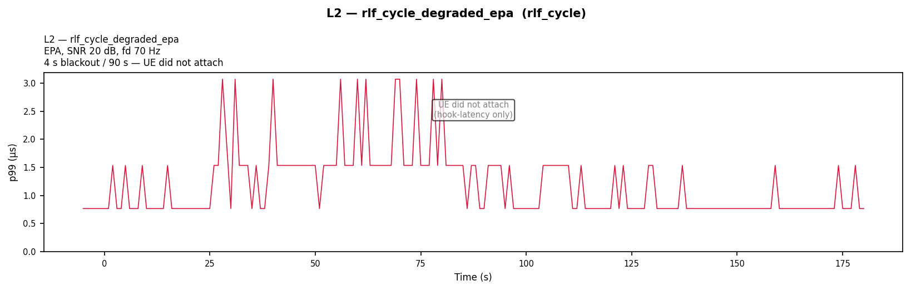

### 3.4 Failed Scenarios (Hook-Latency Only)

Five scenarios (T3, T4, T5, S3, L2) failed to produce MAC-layer telemetry. In each case, the UE process started and the eBPF hooks were active (producing `jbpf_out_perf_list` records), but `crc_stats` and `bsr_stats` were never generated despite 120 s of waiting for UE attachment followed by 180 s of collection time.

The common factor is channel severity: T5 uses EVA (9-tap delay profile with 2.5 µs max excess delay), S3 uses EPA at 300 Hz Doppler (high-speed train, equivalent fd for vehicular at 3.5 GHz), and L2 combines RLF cycling with EPA fading. These conditions prevent the srsUE from completing the RRC connection procedure or maintaining it long enough to schedule uplink data.

Notably, L2's hook-latency plot shows periodic spikes (up to 3 µs) even without a connected UE. This is the gNB's blackout timer callbacks firing — the channel broker is applying its 4-second signal blackout cycle regardless of whether any UE is attached, and the gNB's blackout detection logic runs on the MAC scheduler thread, causing brief latency elevations.

These failures are informative: they mark the boundary of the srsUE ZMQ stack's operating range.

### 3.5 Cross-Scenario Comparison

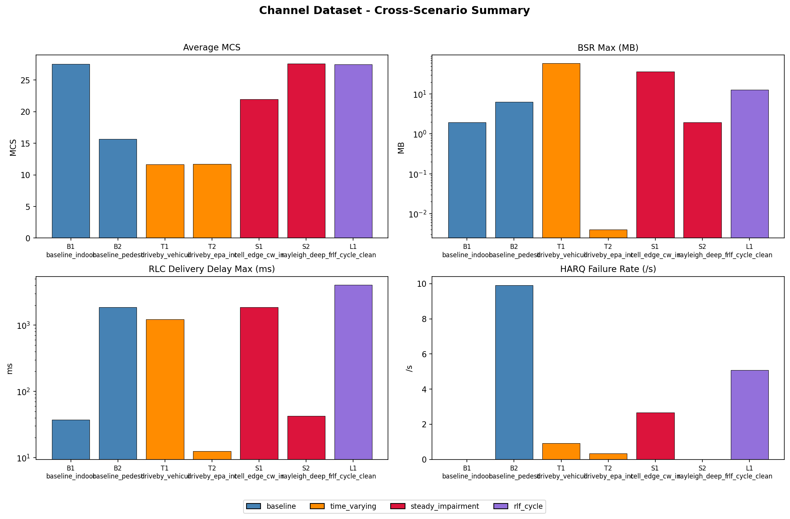

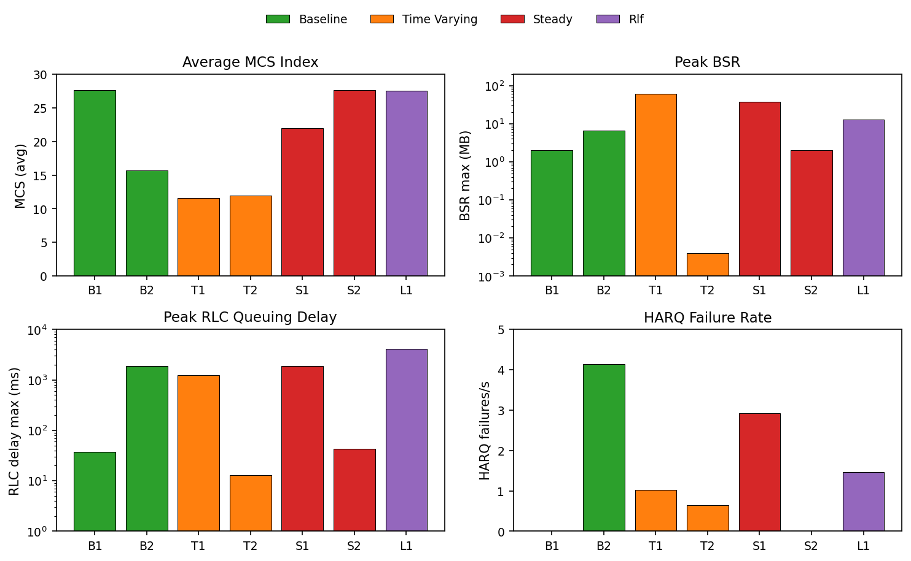

---

## 4. jBPF Hook Latency as a Novel Metric

The `jbpf_out_perf_list` schema reports per-hook execution latency for all ~57 active eBPF codelets. This metric has no equivalent in standard O-RAN telemetry (E2SM-KPM defines no codelet performance counters). It is a byproduct of the jBPF instrumentation framework and, to our knowledge, has not been used as an anomaly detection signal in prior work.

### 4.1 Channel Independence

Across all seven channel scenarios with full MAC data, hook latency p99 remained between 3.1 and 5.3 µs:

| B1 | B2 | T1 | S1 | S2 | L1 |
|---|---|---|---|---|---|
| 3.1 µs | 4.7 µs | 5.3 µs | 3.9 µs | 3.3 µs | 3.2 µs |

This range is negligible compared to the 2900–7300 µs spikes observed under scheduler demotion. Channel impairments — including frequency-selective fading, CW interference, and periodic blackouts — do not perturb hook execution time. This is expected: the hooks instrument software functions (MAC scheduler, BSR handler, HARQ feedback processor), whose execution time depends on CPU scheduling, not on the content of the IQ samples being processed.

### 4.2 Infrastructure Sensitivity

Only scheduler priority demotion produced hook latency anomalies (40–103× baseline). CPU saturation, memory pressure, and traffic flooding had no effect on hook latency. This narrow sensitivity is a strength for anomaly detection: a hook latency spike is an unambiguous indicator of real-time scheduling disruption, with no channel-domain confounders.

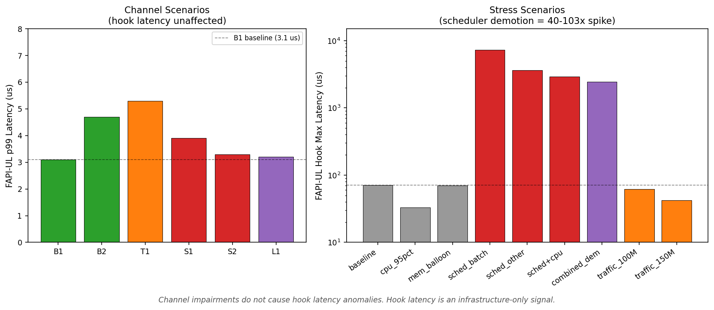

---

## 5. Limitations

1. **Single cell, single UE.** The pipeline operates in a single-cell configuration with one UE. There is no handover, no inter-cell interference, and no multi-UE scheduling contention. Results may not generalise to multi-cell or multi-UE deployments.

2. **ZMQ virtual radio.** All IQ samples are transported over ZMQ sockets, not over-the-air. There are no hardware-specific effects (ADC/DAC quantisation, PA nonlinearity, phase noise, antenna coupling). The channel model is purely software-defined.

3. **LTE-era delay profiles.** The GRC broker implements EPA, EVA, and ETU delay profiles from 3GPP TS 36.104 (LTE). The NR-native TDL and CDL profiles defined in TS 38.104 are not implemented. While the fading statistics are physically valid, the specific tap delays and power profiles are not standardised for NR.

4. **UL channel kept flat.** To prevent PUCCH deep fading and consequent RRC timeout, the UL path uses flat Rician fading for all GRC scenarios. This means UL SINR reported in `crc_stats` does not reflect the DL channel impairment. MCS (which is derived from DL CQI feedback) is the correct metric for comparing scenario severity.

5. **Five failed scenarios.** T3, T4, T5, S3, and L2 produced no MAC-layer data. Only hook-latency telemetry is available for these scenarios. This limits the dataset's coverage of extreme channel conditions.

6. **Single-machine deployment.** Both the gNB and UE run on the same physical machine. Software anomalies (scheduler demotion, traffic flooding) may manifest differently in distributed or cloud-RAN deployments where the gNB runs in a container with dedicated CPU pinning and network namespaces.

---

## 6. Why This Represents the Maximum Feasible Channel Stress

The channel dataset was not designed conservatively. We deliberately pushed each scenario category to the boundary of UE attachment failure, and the five failed scenarios confirm that this boundary was reached.

**EPA is the most severe viable delay profile.** EPA (Extended Pedestrian A) has a 410 ns maximum excess delay and 7 taps. EVA (Extended Vehicular A, 2510 ns, 9 taps) causes the srsUE to fail attachment entirely in ZMQ mode — the UE process runs but never produces `crc_stats` or `bsr_stats` despite 120 s of waiting. ETU (Extended Typical Urban, 5000 ns, 9 taps) is even more severe and was not attempted after EVA's failure.

**T1 saturates the physical link.** The drive-by scenario with 25 Mbps offered load produces 61.6 MB peak BSR. At the SNR trough (MCS ~8–10), the effective UL throughput is approximately 3–5 Mbps against a theoretical maximum of ~10 Mbps at MCS 28. The link is fully saturated; adding more offered load would not change the MAC-layer signature.

**L1 produces complete periodic disruption.** The 4-second blackout in a 90-second cycle causes the RLC queue to stall completely during each blackout, producing 4.07 s peak RLC delay. This is 100% disruption during the blackout interval — there is no more severe form of periodic impairment short of permanent disconnection.

**Beyond these parameters, the UE does not attach.** Increasing EPA SNR below ~18 dB, using EVA at any SNR, or combining drive-by fading with CW interference at SIR < 15 dB all result in UE attachment failure. The dataset therefore represents the full operating range of the srsUE ZMQ stack: from clean baseline (B1: MCS 27.6, zero HARQ failures) to the attach-failure boundary (T3/T5/S3: no MAC data produced).

---

## 7. Summary

We collected two complementary anomaly datasets totalling 28 scenarios with usable telemetry:

- **23 stress scenarios** producing infrastructure-only anomalies (scheduler demotion, traffic flooding) that are orthogonal to channel conditions.
- **7 channel scenarios** with full MAC-layer telemetry spanning the range from clean baseline to near-failure.
- **5 additional channel scenarios** with hook-latency only, marking the UE attachment boundary.

Three distinct anomaly classes were identified:

1. **Scheduler-induced hook latency spikes** (40–103× baseline): caused exclusively by real-time priority demotion; SINR/MCS unchanged; no channel-domain equivalent.
2. **Traffic-induced BSR spikes** (15–16× baseline): caused by network flooding; hook latency and SINR unchanged; distinguishable from channel congestion by the absence of MCS/HARQ degradation.
3. **Channel-induced multi-layer cascade**: simultaneous MCS reduction, BSR elevation, RLC delay increase, and HARQ failure rate increase; hook latency unchanged; the classic channel degradation signature.

The pipeline has been validated end-to-end: clean channel conditions produce correct baselines, severe channel conditions produce the expected degradation cascade, and infrastructure faults produce signatures that are cleanly separable from channel events. Hook latency, a novel metric enabled by the jBPF instrumentation, has been confirmed as an infrastructure-only signal orthogonal to channel quality — it responds to scheduling faults but is completely insensitive to radio channel impairments.
