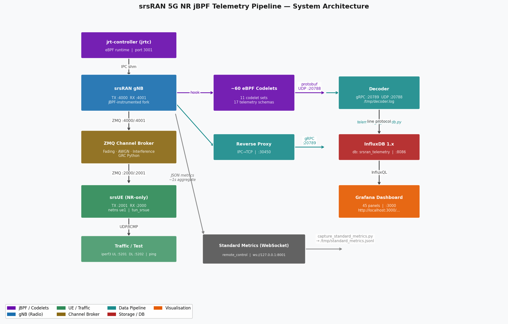

# Project Reference — srsRAN 5G jBPF Telemetry Pipeline

## 1. System Overview

The pipeline instruments an srsRAN Project gNB with approximately 60 eBPF codelets
(via jBPF), routes the resulting telemetry through a decoder into InfluxDB, and
visualises all metrics on a 45-panel Grafana dashboard. A custom ZMQ channel broker
sits between the gNB and a software UE (srsUE), injecting calibrated RF impairments
into the IQ sample stream to produce realistic, time-varying MAC-layer telemetry. An
optional stress injection framework generates labelled anomalous datasets.

All components run on a single Ubuntu 22.04 machine. No physical RF hardware is
required; gNB--UE communication uses ZMQ virtual radio.

For channel broker and channel model details, see
[ZMQ_CHANNEL_BROKER_DOCS.md](ZMQ_CHANNEL_BROKER_DOCS.md).

---

## 2. System Architecture



*Figure: Full pipeline — jrtc → gNB → ZMQ Channel Broker → srsUE → eBPF codelets → Decoder → InfluxDB → Grafana. See also the [telemetry data flow diagram](figures/fig_telemetry_flow.png) and [channel broker internals](figures/fig_channel_broker.png).*

### Startup Order

1. jrt-controller
2. ZMQ Channel Broker (optional; omit with `--no-broker`)
3. gNB (`sudo`)
4. Reverse Proxy
5. Decoder (xterm window)
6. Load codelet sets (10 sets via jrtc-ctl)
7. srsUE + iperf3 UL + iperf3 DL + ping

### Shutdown Order

ping -> iperf3 -> srsUE -> Decoder -> Reverse Proxy -> gNB -> ZMQ Broker -> jrtc

---

## 3. Component Reference

### 3.1 Scripts

| Script | Description |
|--------|-------------|
| `scripts/launch_mac_telemetry.sh` (~570 lines) | One-shot pipeline launcher. Starts all components in order with dependency checks and coloured status output. Waits up to 15 s for UE TUN IP before starting iperf3. |
| `scripts/stop_mac_telemetry.sh` (~110 lines) | Reverse-order pipeline teardown. Stops ping, iperf3, srsUE, decoder, reverse proxy, gNB, broker, and jrtc. |
| `scripts/zmq_channel_broker.c` (~560 lines) | C broker: AWGN + Rician/Rayleigh flat fading + CW interference. See [ZMQ_CHANNEL_BROKER_DOCS.md](ZMQ_CHANNEL_BROKER_DOCS.md). |
| `scripts/srsran_channel_broker.py` (~1050 lines) | GRC Python broker: superset of C broker, adding EPA/EVA/ETU fading, CFO, burst drops, time-varying scenarios, narrowband interference, and live QT GUI. |
| `scripts/telemetry_to_influxdb.py` (616 lines) | Tails `/tmp/decoder.log`, parses 16 protobuf schema types, converts cumulative MAC counters to per-window deltas, writes to InfluxDB via HTTP line protocol. |
| `scripts/plot_all_telemetry.py` (944 lines) | Generates 15 PNGs covering all 17 telemetry schemas from a decoder log file. |
| `scripts/stress_anomaly_collect.sh` (~830 lines) | Applies 23 system-level stressors (CPU, memory, scheduling, traffic) to a running pipeline and captures labelled MAC telemetry per scenario. Records per-scenario UL/DL throughput and ping RTT. Outputs `manifest.csv`. |
| `scripts/collect_channel_realistic.sh` | Automated multi-scenario realistic channel dataset collector. Runs 10 real-world-grounded GRC channel scenarios (baselines, time-varying, steady impairment, RLF cycles), each for a configurable duration. Full pipeline teardown/restart between scenarios. Exports to CSV + HDF5 via `export_channel_dataset.py`. Outputs `manifest.csv` and `summary.txt`. |
| `scripts/export_channel_dataset.py` | Converts decoder logs from a channel dataset run into structured CSV and HDF5 files. Handles binary log files (reads raw bytes). Extracts 11 telemetry schemas including the novel `jbpf_out_perf_list` hook-latency schema. Supports `--format csv\|hdf5\|both`. |
| `scripts/plot_stress_comparison.py` | Cross-scenario comparison plots for stress anomaly datasets. Generates 7 PNGs: hook latency bars, BSR bars, HARQ+SINR, normalised anomaly heatmap, time-series overlay, multi-hook grouped bars, summary dashboard. |
| `scripts/add_zmq_subscribers.sh` | Registers UE1 and UE2 subscriber entries in Open5GS via the WebUI API. Required for jrtc-apps ZMQ mode. |

### 3.2 Launch Script Flags

```
--snr N            AWGN SNR in dB (default: 28)
--fading           Enable Rician flat fading (K=3 dB, fd=5 Hz)
--k-factor N       Rician K-factor in dB (default: 3)
--doppler N        Max Doppler frequency in Hz (default: 5)
--rayleigh         Pure Rayleigh fading (K=-100 dB; may crash UE)
--grc              Use GRC Python broker instead of C broker
--gui              Use GRC broker with live QT GUI (implies --grc)
--profile P        3GPP delay profile: epa | eva | etu (implies --grc)
--cfo N            Carrier frequency offset in Hz (implies --grc)
--drop-prob N      Subframe drop probability 0--0.25 (implies --grc)
--scenario S       Time-varying scenario: drive-by | urban-walk | edge-of-cell | rlf-cycle
--iperf-bitrate N  UL iperf3 target bitrate (default: 10M, e.g. 25M)
--iperf-dl-bitrate N  DL iperf3 target bitrate (default: 5M)
--interference-type T   DL interferer: none (default) | cw | narrowband
--interference-freq Hz  Interferer frequency offset (default: 1e6 Hz)
--sir N            Signal-to-interference ratio in dB (default: 20)
--no-broker        Skip the channel broker (perfect channel)
--no-ue            Skip srsUE and iperf3
--no-traffic       Skip iperf3 and ping (UE only)
--no-grafana       Skip Grafana/InfluxDB ingestor
```

`--interference-type narrowband` automatically selects `--grc`.

### 3.3 Source Repositories

| Path | Contents |
|------|----------|
| `~/Desktop/srsRAN_Project_jbpf/` | 5G gNB with jBPF hooks; pipeline config at `configs/gnb_zmq_jbpf.yml` |
| `~/Desktop/jrt-controller/` | jBPF runtime controller; CLI at `tools/jrtc-ctl/` |
| `~/Desktop/jrtc-apps/codelets/` | 11 codelet set directories (~60 eBPF programs) |
| `~/Desktop/srsRAN_4G/` | srsUE source; binary at `/usr/local/bin/srsue` |

### 3.4 Configuration Files

| File | Key Settings |
|------|-------------|
| `config/gnb_zmq_jbpf.yml` | ZMQ `tx_port=4000, rx_port=4001`; Band 3, DL ARFCN 368500, 20 MHz, SCS 15 kHz, 106 PRBs; `tx_gain=75, rx_gain=75`; MCS table: qam64 |
| `config/ue_zmq.conf` | ZMQ `tx_port=2001, rx_port=2000`; NR-only (`nof_carriers=0`); Band 3, 106 PRBs; `tx_gain=50, rx_gain=40`; USIM: milenage, IMSI `999700123456780`; network namespace `ue1`, TUN `tun_srsue` |

---

## 4. Port Map

| Port | Protocol | Purpose |
|------|----------|---------|
| 2000 | TCP/ZMQ | Broker REP -> UE REQ (DL IQ to UE) |
| 2001 | TCP/ZMQ | UE REP -> Broker REQ (UL IQ from UE) |
| 3001 | TCP | jrtc REST server -- **reserved; do not use** |
| 4000 | TCP/ZMQ | gNB REP -> Broker REQ (DL IQ from gNB) |
| 4001 | TCP/ZMQ | Broker REP -> gNB REQ (UL IQ to gNB) |
| 5201 | TCP/UDP | iperf3 UL server (core side, 10 Mbps) |
| 5202 | TCP/UDP | iperf3 DL server (core side, `--reverse`, 5 Mbps) |
| 5213 | UDP | Stress-script UL measurement probe (10 s burst) |
| 5214 | UDP | Stress-script DL measurement probe (10 s burst, reverse) |
| 8086 | TCP | InfluxDB HTTP API |
| 20788 | UDP | jBPF -> decoder telemetry data |
| 20789 | TCP/gRPC | jrtc-ctl decoder schema registration |
| 30450 | TCP | Reverse proxy (IPC-to-TCP bridge for codelet loading) |
| 38412 | SCTP | AMF (Open5GS) NGAP signalling |

---

## 5. Grafana Dashboard

45-panel dashboard at `http://localhost:3000` (admin / admin), auto-refresh 5 s.

| Section | Panels | Metrics |
|---|---|---|
| MAC layer | 8 | HARQ failures, SINR, MCS, CRC success rate, BSR, UCI/CQI, timing advance |
| RLC layer | 6 | UL/DL SDU delay (avg, max), PDU bytes, queue depth |
| PDCP layer | 4 | UL/DL throughput bytes, latency |
| FAPI layer | 6 | DL/UL MCS, PRB utilisation, TBS, RNTI allocation |
| jBPF hook latency | 8 | p50/p90/p95/p99 per hook (FAPI UL/DL, MAC, RLC, PDCP) |
| RRC / NGAP events | 5 | Attach/detach events, RRC procedures, NGAP procedures |
| **UE application layer** | **5** | **UL throughput (Mbps), DL throughput (Mbps), ping RTT (ms), DL jitter (ms), DL packet loss (%)** |
| Summary statistics | 6 | Current SINR, TX success %, HARQ failures, CQI, jBPF p50, BSR |
| Hook latency histograms | 3 | Full histogram heatmaps for FAPI UL/DL and MAC-SCHED hooks |

The UE application layer section uses `ue_traffic_ingestor.py` to parse iperf3 JSON output and ICMP ping results into InfluxDB (`iperf_ul`, `iperf_dl`, `ping_rtt` measurements), providing end-to-end visibility from radio channel to application throughput in a single dashboard.

---

## 6. Telemetry Schemas

Eleven codelet sets load successfully at runtime (~60 codelets total, ~57 active).
The `ue_contexts` set loads partially (9/11 codelets; 2 disabled due to a missing
type in this srsRAN version). `slice_mgmt` cannot compile.

### 5.1 Periodic Schemas (time-series)

| Layer | Schema | Key Fields | Rate |
|-------|--------|------------|------|
| MAC | `crc_stats` | `succTx, cntTx, harqFailure, sumSinr/cntSinr, sumRsrp/cntRsrp, retxHist[16]` | ~95/min |
| MAC | `bsr_stats` | `bytes, cnt` | ~47/min |
| MAC | `uci_stats` | `csi.cqi, csi.ri, srDetected, timeAdvanceOffset` | ~52/min |
| MAC | `harq_stats` | `mcs{total,count,min,max}, consRetx, perHarqTypeStats[3]{count,tbsBytes,cqi}` -- DL and UL share this schema; distinguished by `_stream_id` | ~96/min |
| RLC | `rlc_dl_stats` | `pduTxBytes, sduNewBytes, sduQueueBytes, am.pduRetxCount` per bearer | ~51/min |
| RLC | `rlc_ul_stats` | `pduBytes, sduDeliveredBytes, sduDeliveredLatency` per bearer | ~50/min |
| PDCP | `dl_stats` | `dataPduTxBytes, dataPduRetxBytes, sduTxLatency, sduDiscarded` per bearer | ~1/min |
| PDCP | `ul_stats` | `rxDataPduBytes, sduDeliveredBytes, rxControlPduBytes` per bearer | ~50/min |
| FAPI | `dl_config_stats` | `l1McsAvg, l1PrbAvg, l1TbsAvg, l1Cnt, l1DlcTx, rnti` | ~50/min |
| FAPI | `ul_config_stats` | Same structure as DL | ~48/min |
| FAPI | `crc_stats` | `l1SnrMax, l1SnrMin, l1CrcSnrHist, l1TaMax, l1TaMin, l1CrcTaHist` | ~48/min |
| jBPF | `jbpf_out_perf_list` | `hookPerf[]{hookName, num, min, max, p50, p90, p95, p99}` (ns) | ~60/min |

### 5.2 Event-Driven Schemas

| Layer | Schema | Key Fields | Frequency |
|-------|--------|------------|-----------|
| FAPI | `rach_stats` | TA histogram, power histogram | 1 per attach |
| RRC | `rrc_ue_add` | `cRnti, pci, tcRnti, nci, plmn` | 1 per attach |
| RRC | `rrc_ue_procedure` | `procedure` (1=Setup, 2=Reconfig, 3=Reestab, 4=SecurityMode), `success`, `meta` | ~3 per session |
| RRC | `rrc_ue_remove` | `cucpUeIndex` | 1 per detach |
| NGAP | `ngap_procedure_started` | `procedure` (1=InitialUE, 2=UEContextRelease, 3=InitialContextSetup), `ueCtx` | ~3 per session |
| NGAP | `ngap_procedure_completed` | `procedure, success, ueCtx` | ~3 per session |

### 5.3 Data Quirks

| Quirk | Detail |
|-------|--------|
| MAC vs FAPI `crc_stats` name collision | Same schema name; differentiate by `_schema_proto_package`: `mac_sched_crc_stats` vs `fapi_gnb_crc_stats` |
| FAPI "Avg" fields are cumulative sums | `l1McsAvg / l1Cnt` yields the true average. Example: `108 / 5 = 21.6` MCS |
| All stats are cumulative | Counters never reset. Diff consecutive messages for per-interval values |
| Sentinel values | `min = 4294967295` (UINT32_MAX) and `max = 0` mean "no data yet" |
| Ghost DL HARQ entry | `duUeIndex 513` appears in DL HARQ stats; filter `duUeIndex >= 32` |
| DL RNTI filter | `rnti > 1000` selects UE data allocations (vs system/SIB RNTIs) |
| CQI always 15 | CQI is computed inside the UE; IQ-level noise injection does not affect it |
| DL-side RLC/PDCP mostly empty | With uplink-only iperf3 traffic, DL carries only control/signalling |

### 5.4 Log Format

```
time="2026-03-08T14:49:23+01:00" level=info msg="REC: {\"_schema_proto_msg\":\"crc_stats\", ...}"
```

Parsing: match `msg="REC: (.+)"` at end of line, unescape `\"` -> `"`, then `json.loads()`.

---

## 6. Telemetry Validation (SNR=30 dB + Rayleigh fd=10 Hz)

| Metric | Value | Assessment |
|--------|-------|------------|
| SINR mean | 30.3 dB | Matches configured SNR |
| SINR std dev | 4.6 dB | Consistent with Rayleigh fading statistics |
| SINR range | 17.6--47.7 dB (30 dB spread) | Realistic for Rayleigh channel |
| Deep fades (> 6 dB below mean) | 9.9% | Consistent with Rayleigh CDF |
| SINR during HARQ failures | 23.1 dB mean vs 31.2 dB otherwise | Fading--failure correlation confirmed |
| TX success rate | 95.9% mean; 33.3% worst window | Bursty errors during deep fades |
| DL MCS | 19.7--27.9 (mean 26.9) | Adaptive link adaptation active |
| UL MCS | 18.6--28.0 (mean 27.1) | Symmetric fading on both paths |
| CQI | 15.0 (constant) | Expected; UE-computed metric |
| BSR buffer | 76 B -- 3.8 MB | Buffer build-up during fade events |
| RRC lifecycle | 1 add -> 3 procedures -> 1 remove | Correct attach/detach sequence |
| NGAP lifecycle | 3 started -> 3 completed (all success) | Standard 5G NR core flow |
| jBPF hook latency | p50 = 192--384 ns; p99 < 1.5 us | Negligible instrumentation overhead |

---

## 7. How to Run

```bash
# ── C broker: Rician fading (recommended; K=3 dB, SNR=28 dB, fd=5 Hz) ──
./scripts/launch_mac_telemetry.sh --fading

# ── GRC broker: EPA frequency-selective fading ────────────────────────
./scripts/launch_mac_telemetry.sh --grc --profile epa --snr 28

# ── GRC broker with live QT GUI ───────────────────────────────────────
./scripts/launch_mac_telemetry.sh --gui --fading

# ── Interference ──────────────────────────────────────────────────────
./scripts/launch_mac_telemetry.sh --interference-type cw --sir 10
./scripts/launch_mac_telemetry.sh --interference-type narrowband --sir 15

# ── Perfect channel ───────────────────────────────────────────────────
./scripts/launch_mac_telemetry.sh --no-broker

# ── Stop ──────────────────────────────────────────────────────────────
./scripts/stop_mac_telemetry.sh

# ── Generate telemetry plots ──────────────────────────────────────────
python3 scripts/plot_all_telemetry.py /tmp/decoder.log
# Output: plots/ directory (15 PNGs)

# ── Stress anomaly dataset (23 scenarios) ────────────────────────────
./scripts/stress_anomaly_collect.sh --duration 180
# Output: dataset/ directory + manifest.csv

# ── Rebuild C broker ─────────────────────────────────────────────────
gcc -O2 -o scripts/zmq_channel_broker scripts/zmq_channel_broker.c -lzmq -lm -lpthread

# ── Rebuild jrtc-ctl ─────────────────────────────────────────────────
cd ~/Desktop/jrt-controller/tools/jrtc-ctl
CGO_CFLAGS="-I/home/maxim/Desktop/jrt-controller/out/inc" \
CGO_LDFLAGS="-L/home/maxim/Desktop/jrt-controller/out/lib -ljrtc_router_stream_id_static" \
go build --trimpath -o /home/maxim/Desktop/jrt-controller/out/bin/jrtc-ctl main.go
```

---

## 8. Known Issues

| Issue | Detail |
|-------|--------|
| CQI always 15 | CQI is computed inside srsUE and is unaffected by IQ-level noise |
| UL more impacted than DL | UE TX gain (50) is lower than gNB TX gain (75); same SNR produces worse UL decoding |
| PHR always empty | srsUE NR MAC does not implement power headroom reporting |
| `duUeIndex 513` in DL HARQ | Ghost scheduler entry; filter `duUeIndex >= 32` |
| UE lifetime ~3 min with Rayleigh fading | Sustained complete nulls cause PBCH SFN mismatch; use Rician (`--fading`) instead |
| srsUE channel emulator inactive for NR | `[channel.*]` config sections are wired to the LTE PHY path only and are silently ignored in NR-only operation |
| `ue_contexts` set partially loaded | 2 of 11 codelets reference `jbpf_pdu_session_ctx_info`, which is absent in this srsRAN version |
| FAPI SNR max saturates at 255 | Raw L1 maximum always hits the hardware ceiling; not adjustable via parameters |
| CQI variance with aggressive GRC fading | With K=0 and SNR <= 20 dB, CQI occasionally dips to 12--13 |
| GRC broker CPU usage | Approximately 22% of one core at 46 MHz bandwidth; ensure adequate headroom |
| GUI requires display | `--gui` requires an X11 or Wayland display; use `--grc` for headless operation |
