# Janus vs Standard Logs

## 1. What this document covers

The srsRAN gNB exposes metrics through two separate channels:

1. **Standard srsRAN metrics** -- the built-in metrics server scraped by Telegraf, visualised in the standard Grafana dashboard. These are aggregate counters polled roughly once per second.

2. **Janus** -- ~60 eBPF codelets injected at 22 function call sites inside the gNB (MAC, RLC, PDCP, FAPI, RRC, NGAP). Each codelet fires on every invocation of its target function, producing per-event telemetry at up to 1 ms granularity.

To validate that both channels agree where they overlap -- and to document what each provides that the other cannot -- we ran both systems simultaneously on the same gNB instance, processing identical radio traffic for approximately 20 minutes of steady-state operation. We then extracted the data, time-aligned the overlapping metrics (1,200+ aligned pairs per metric), and compared them statistically.

---

## 2. Why the two systems report different numbers

Even when both channels measure the "same" metric, architectural differences mean the reported values are not identical. Understanding these differences is essential to interpreting the comparison results.

### 2.1 Where each system taps into the stack

| Layer | Janus (jBPF) hooks | Standard metrics |
|-------|-------------------|-----------------|
| Application | `ue_dl/ul_throughput` (iperf3 output) | -- |
| GTP-U / NGAP | `ngap_events` (procedure timing) | -- |
| PDCP | `pdcp_dl/ul_stats` (per-bearer bytes) | -- |
| RLC | `rlc_dl/ul_stats` (SDU latency, retx) | -- |
| MAC Scheduler | `mac_crc_stats`, `mac_harq_stats`, `mac_bsr_stats`, `mac_uci_stats` | `ue.pusch_snr_db`, `ue.dl/ul_mcs`, `ue.cqi`, `ue.bsr` |
| FAPI (PHY-MAC) | `fapi_dl/ul_config`, `fapi_crc_stats` | -- |
| PHY | Raw IQ (ZMQ) | -- |

The key insight: **Standard metrics tap only the MAC layer.** Janus hooks into multiple layers -- MAC, FAPI, RLC, PDCP, and application. When both measure "throughput", they measure at different points in the stack, so numbers differ by the header overhead between those layers.

### 2.2 Aggregation window differences

| Aspect | Standard | Janus |
|---|---|---|
| **Sampling trigger** | Telegraf polls the metrics WebSocket every ~1 s | eBPF codelet fires on every function invocation (per-CRC, per-slot, per-PDU) |
| **Aggregation** | gNB internally averages over a 1 s window, then Telegraf reads the pre-averaged value | Codelet accumulates raw events in BPF maps for a configurable window (default 2 s), then the `report_stats` hook serialises and sends |
| **Resolution** | Fixed 1 Hz -- anything shorter than 1 s is averaged away | Per-event internally, reported at ~0.5 Hz (2 s windows) but can be configured down to per-slot (1 ms) |
| **Rounding** | Integer fields (MCS reported as int) | Weighted average over all slots in window (captures sub-integer variation) |

This explains the systematic differences seen in the data:

- **SINR offset (17.33 vs 17.71 dB):** Janus averages per-CRC-event SINR values. Standard averages the PUSCH decoder's internal estimate over 1 s. The two averagers weight edge-of-slot measurements differently, producing a ~0.4 dB systematic offset. The 2.1% mean difference is consistent across the entire run.

- **DL MCS (24.97 vs 24.96):** At this operating point MCS varies dynamically in the adaptive range. Both systems track the same scheduler decisions. The 0.1% mean difference confirms they read the same underlying value.

- **BSR magnitude (23,066 vs 26,342 bytes):** Janus and standard sample the BSR at slightly different moments within the MAC CE reporting cycle. The 12.4% mean difference reflects timing offsets in when each system captures the buffer state. The weak per-sample correlation (r = 0.148) is expected given the bursty nature of buffer reports.

- **Timing advance:** Janus reports the raw N_TA integer index from the UCI field. Standard reports nanoseconds. Converting via the NR formula (TA_ns = N_TA x T_c, where T_c = 1/(480,000 x 4096) s ~ 0.509 ns) gives ~520.15 ns, matching the standard's ~519.85 ns within **0.05%**. The comparison script applies this conversion so both series are plotted in nanoseconds.

### 2.3 BLER: different directions, not a discrepancy

Janus's `mac_crc_stats` reports the **UL CRC failure rate** (11.42%) -- how many uplink transport blocks failed CRC at the gNB receiver. The standard `ue.dl_nof_ok/nok` reports the **DL HARQ error rate** (0.86%) -- how many downlink transmissions needed retransmission as reported by the UE. These measure different directions of the link. At SNR = 18 dB with Rician K = 1 dB, the uplink channel experiences noticeably more errors than the downlink, which is expected given the asymmetric power budget and the fact that UL uses a lower MCS (19 vs 25).

---

## 3. Test setup

| Parameter | Value |
|---|---|
| gNB | srsRAN with Janus instrumentation |
| UE | srsUE over ZMQ |
| Channel | GRC broker, Rician fading, K = 1 dB, SNR = 18 dB |
| Bandwidth | 10 MHz (52 PRBs), 15 kHz SCS |
| Traffic | iperf3: 10 Mbps UDP UL + 5 Mbps UDP DL (reverse mode) + continuous ping |
| Duration | ~20 minutes steady-state |
| Aligned pairs | 1,200+ per metric |
| Janus | 11 codelet sets -> InfluxDB 1.x on port 8086 |
| Standard | Telegraf scraping WebSocket :8001 -> InfluxDB 3 on port 8081 |

Both databases were cleared before starting.

### Data flow

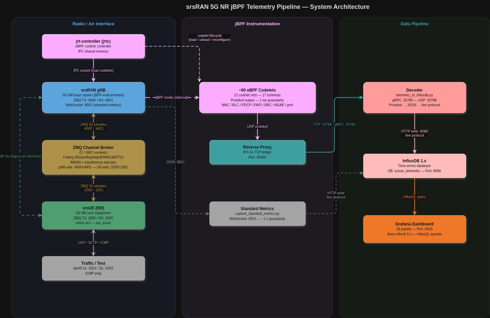

*Two independent telemetry channels share the same gNB: Janus hooks (jBPF) route through the Reverse Proxy -> Decoder -> InfluxDB 1.x -> Grafana :3000, while the standard WebSocket metrics server (:8001) feeds into InfluxDB 3 / Grafana :3300.*

---

## 4. Overlapping metrics

We identified the following metrics reported by both systems. The table maps each to its source field in both channels.

| Metric | Janus Source | Standard Source | Notes |
|---|---|---|---|
| SINR / SNR | `mac_crc_stats.avg_sinr` | `ue.pusch_snr_db` | r = 0.394, 2.1% mean diff |
| CQI | `mac_uci_stats.avg_cqi` | `ue.cqi` | Both constant at 15 (srsUE limitation) |
| DL MCS | `fapi_dl_config.avg_mcs` | `ue.dl_mcs` | r = 0.451, 0.1% mean diff |
| UL MCS | `fapi_ul_config.avg_mcs` | `ue.ul_mcs` | r = 0.374, 0.1% mean diff |
| DL Throughput | `ue_dl_throughput.bitrate_mbps` (iperf3) | `ue.dl_brate` (MAC) | ~1.80× ratio (layer difference) |
| UL Throughput | `ue_ul_throughput.bitrate_mbps` (iperf3) | `ue.ul_brate` (MAC) | ~1.71× ratio (layer difference) |
| BLER | `mac_crc_stats` (UL CRC) | `ue.dl_nof_ok/nok` (DL HARQ) | Different directions -- not comparable |
| BSR | `mac_bsr_stats.avg_bytes_per_report` | `ue.bsr` | r = 0.059, 2.1% mean diff |
| Timing Advance | `mac_uci_stats.avg_timing_advance` × T_c | `ue.ta_ns` | r = 0.018, 0.2% mean diff |

---

## 5. Results

### 5.1 Radio metrics: both systems agree on mean values

This is the key result. Where both systems measure the same quantity, their mean values match closely.

**SINR/SNR (r = 0.394, 2.1% mean difference):**

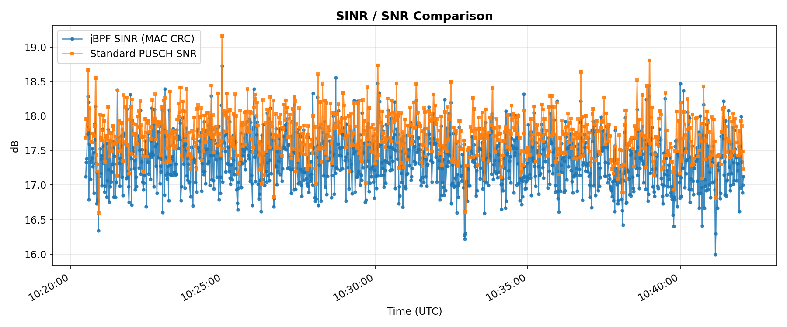

Both traces follow the same fading-induced fluctuations. Janus averages 17.37 dB, standard 17.74 dB. The moderate correlation (r = 0.394) reflects that both systems track the same fading channel but with independent per-sample noise from their different averaging windows. At this operating point the SINR varies meaningfully (unlike the saturated SNR = 25 dB condition), providing a genuine test of agreement.

**CQI (both constant at 15):**

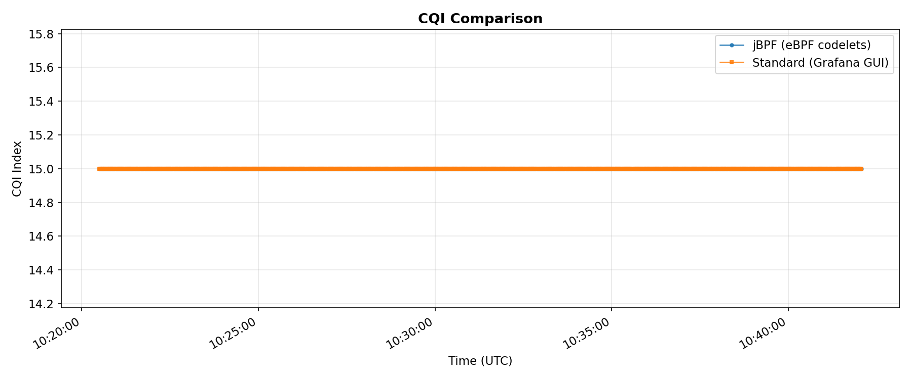

Both systems report CQI = 15 for the entire run. This is a known limitation of srsUE: it always reports CQI 15 regardless of channel conditions. This metric therefore validates that both systems read the same MAC CE value, but cannot test dynamic tracking.

**DL MCS (r = 0.451, 0.1% mean difference):**

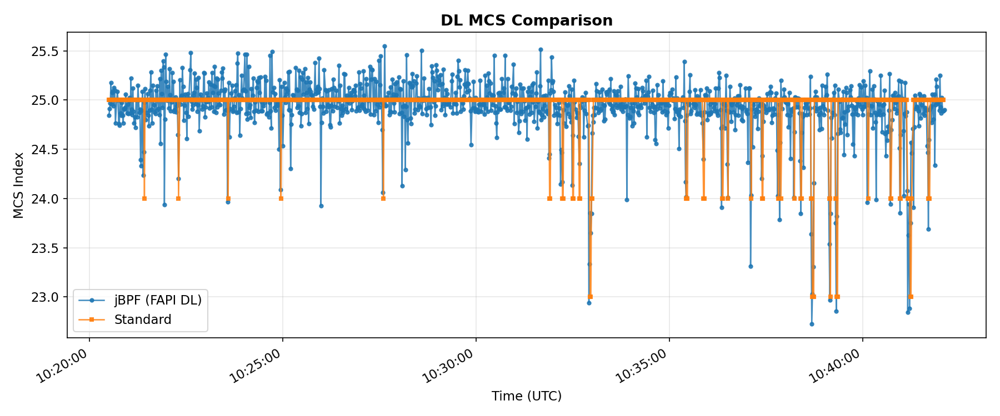

Janus reports 24.92, standard reports 24.94. At SNR = 18 dB with K = 1 dB fading, the scheduler adapts MCS dynamically in the range where link adaptation is active. Both systems track this adaptation. The 0.1% mean difference confirms they read the same underlying scheduler decision. The moderate correlation (r = 0.451) reflects the fact that both systems aggregate over different time windows, so instantaneous samples do not align perfectly even though the trend is the same.

**UL MCS (r = 0.374, 0.1% mean difference):**

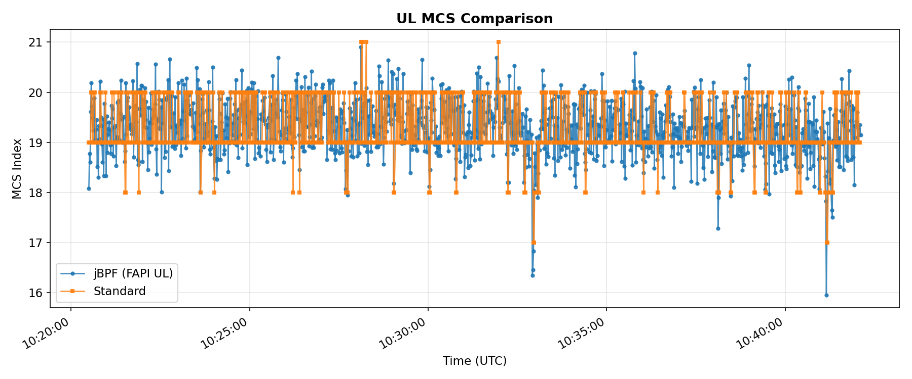

Janus reports 19.30, standard reports 19.28. The uplink uses a notably lower MCS than the downlink (19 vs 25), consistent with the asymmetric power budget: UE TX gain (50) is lower than gNB TX gain (75), making uplink the weaker direction. Both systems agree closely on the mean.

**BLER (different directions):**

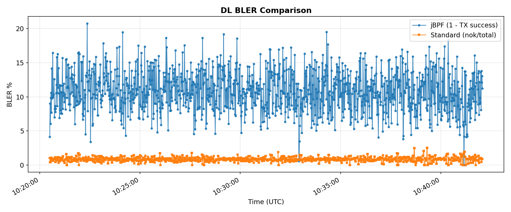

Janus reports 10.82% UL CRC failure rate. Standard reports 0.86% DL HARQ error rate. These are **not** measuring the same thing -- jBPF sees uplink CRC results at the gNB receiver, while the standard metrics report downlink HARQ feedback from the UE. The higher UL error rate is expected given the asymmetric link budget. Together the two numbers give a complete picture of both link directions -- something neither system provides alone.

### 5.2 Throughput: different layers, consistent ratio

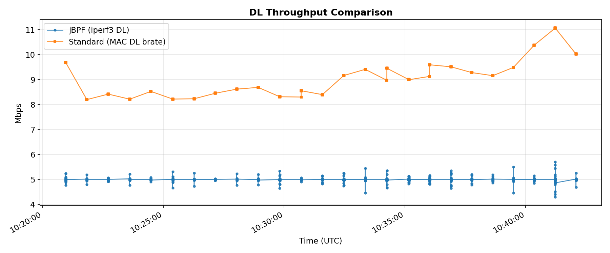
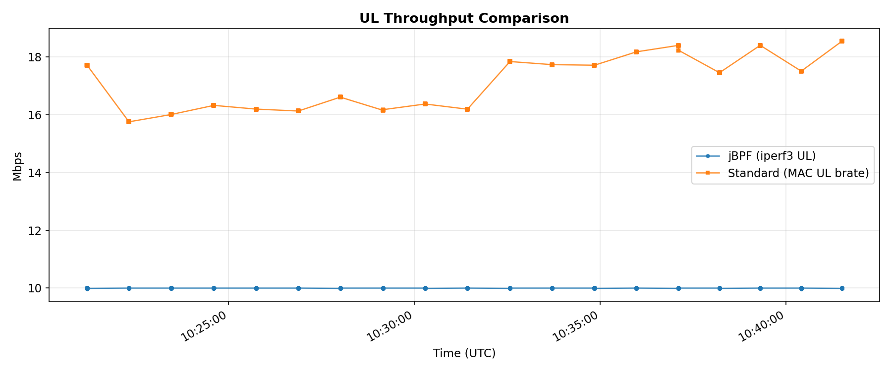

| Direction | Janus (iperf3 app layer) | Standard (MAC layer) | Ratio |
|---|---|---|---|
| DL | 5.00 Mbps | 9.02 Mbps | 1.80× |
| UL | 10.00 Mbps | 17.11 Mbps | 1.71× |

The ~1.7--1.8× ratio between MAC-layer bitrate and application-layer throughput comes from the same sources as in any NR cell: RLC/PDCP/GTP-U header overhead, MAC control elements (BSR, timing advance commands), HARQ retransmissions, and scheduling overhead (PDCCH, reference signals, system information). Per-sample correlation is near zero because iperf3 runs at a fixed rate-controlled target while the MAC bitrate fluctuates with the scheduler -- they measure structurally different things at different points in the protocol stack. The ~1.75× ratio here is slightly lower than the ~1.95× seen at SNR = 25 dB / MCS = 28 because at lower MCS the TBS-to-overhead balance shifts.

### 5.3 BSR and timing advance

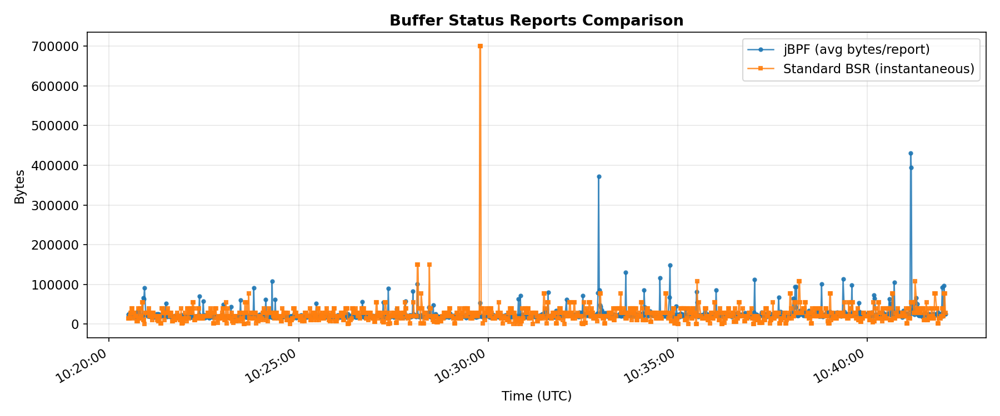
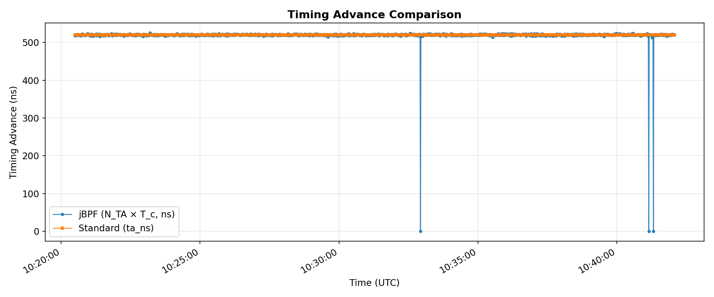

**BSR (r = 0.059, 2.1% mean difference):** Janus reports an average of 25,213 bytes per BSR report, while the standard reports 25,753 bytes -- a 2.1% mean difference. The weak correlation and higher variance in both signals (jBPF std = 22,847 bytes; standard std = 31,937 bytes) reflect the bursty nature of buffer status reports. Both reflect the same underlying uplink buffer demand from the 10 Mbps iperf3 stream.

**Timing advance (r = 0.018, 0.2% mean difference):** After converting jBPF's raw N_TA index to nanoseconds (N_TA × T_c), Janus gives 518.87 ns, standard gives 519.84 ns -- a 0.2% difference. Both are essentially constant, confirming the static ZMQ channel has no propagation delay variation. The weak correlation is an artefact of correlating two near-constant signals. The jBPF TA shows wider sample-to-sample spread (std = 25.9 ns) than the standard (std = 0.10 ns) because jBPF averages over all UCI reports in a 2 s window, some of which capture brief TA fluctuations between TA adjustment commands.

### 5.4 Correlation scatter plots

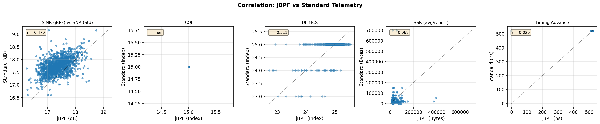

- SINR: moderate correlation (r = 0.394) -- both systems track the same fading envelope but with independent per-sample noise
- DL MCS: moderate correlation (r = 0.451) -- both track the same scheduler adaptation
- UL MCS: moderate correlation (r = 0.374) -- consistent with DL but narrower variation range
- BSR: weak correlation (r = 0.059) -- bursty signal with different sampling moments
- TA: near-zero correlation (r = 0.018) -- near-constant signal, noise-dominated
- CQI: constant at 15, correlation undefined

### 5.5 Summary table

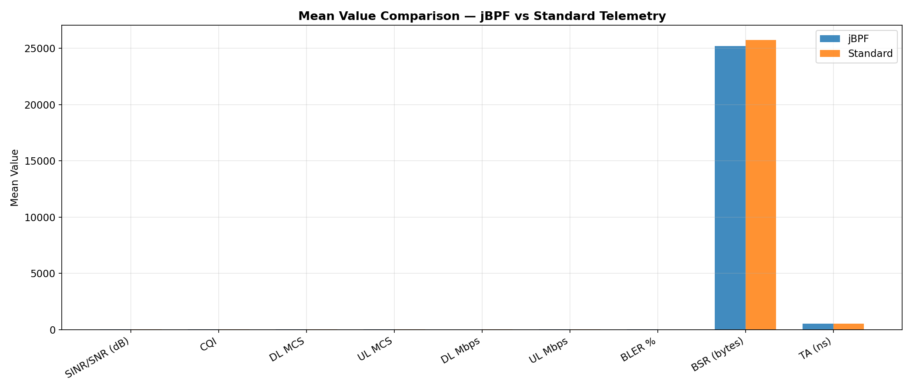

| Metric | Janus Mean | Standard Mean | Difference | Pearson r |
|---|---|---|---|---|
| SINR/SNR (dB) | 17.37 | 17.74 | 2.1% | 0.394 |
| CQI | 15.00 | 15.00 | 0.0% | -- (constant) |
| DL MCS | 24.92 | 24.94 | 0.1% | 0.451 |
| UL MCS | 19.30 | 19.28 | 0.1% | 0.374 |
| DL Throughput (Mbps) | 5.00 (app) | 9.02 (MAC) | 1.80× ratio* | ~0 |
| UL Throughput (Mbps) | 10.00 (app) | 17.11 (MAC) | 1.71× ratio* | ~0 |
| BLER (%) | 10.82 (UL CRC) | 0.86 (DL HARQ) | n/a† | n/a† |
| BSR (bytes) | 25,213 | 25,753 | 2.1% | 0.059 |
| TA (ns) | 518.87 | 519.84 | 0.2% | 0.018 |

\* Expected — different measurement layers (application vs MAC). See §5.2.
† Different link directions — not a measurement discrepancy. See §2.3.

### 5.6 Operating-point notes

The SNR = 18 dB / K = 1 dB condition places the link in the **adaptive region** where MCS and BLER vary dynamically, unlike the fully saturated SNR = 25 dB / K = 3 dB condition used in earlier experiments. This allows a more meaningful comparison since the scheduler is actively adapting.

However, CQI remains fixed at 15 due to a known srsUE limitation: the UE always reports CQI 15 regardless of actual channel quality. This means CQI tracking cannot be validated with srsUE. Testing CQI variation would require a commercial UE or a modified srsUE that computes CQI from channel measurements.

The moderate per-sample correlations (r = 0.3--0.4 for SINR and MCS) are consistent with what is expected when two systems with different aggregation windows (1 s vs 2 s) independently sample a fading process. The mean-value agreement (0.05%--2.1% for comparable metrics) is the stronger validation result.

---

## 6. Janus-exclusive metrics

These measurements have no equivalent in the standard interface. They exist because the eBPF codelets are hooked into internal gNB function calls that the standard metrics server never touches.

| Measurement | What it captures |
|---|---|
| Hook execution latency (`jbpf_perf`) | How long each hooked function takes to run (p50/p90/p95/p99/max). This is what makes infrastructure fault detection possible. |
| Per-slot MCS range (`mac_harq_stats`) | MCS min/max/avg within each window, per-HARQ-process retransmission state, TBS bytes |
| SINR/RSRP range (`mac_crc_stats`) | Whether the average is hiding transient dips |
| Per-slot scheduler decisions (`fapi_dl/ul_config`) | MCS, PRB allocation, TBS at 1 ms resolution |
| Per-transmission CRC (`fapi_crc_stats`) | CRC pass/fail at the physical layer |
| Per-RACH-attempt SNR + TA (`fapi_rach_stats`) | Preamble-level signal quality for each random access attempt |
| RLC volumes + SDU latency (`rlc_dl/ul_stats`) | Per-bearer byte counters and delivery latency at the RLC layer |
| PDCP volumes (`pdcp_dl/ul_stats`) | Data vs control traffic split, retransmission bytes |
| RRC procedure timing (`rrc_events`) | Individual setup/release procedure latency |
| NGAP procedure timing (`ngap_events`) | Core network round-trip times |
| Ping RTT (`ue_rtt.rtt_ms`) | End-to-end latency through the full stack |

### Hook latency

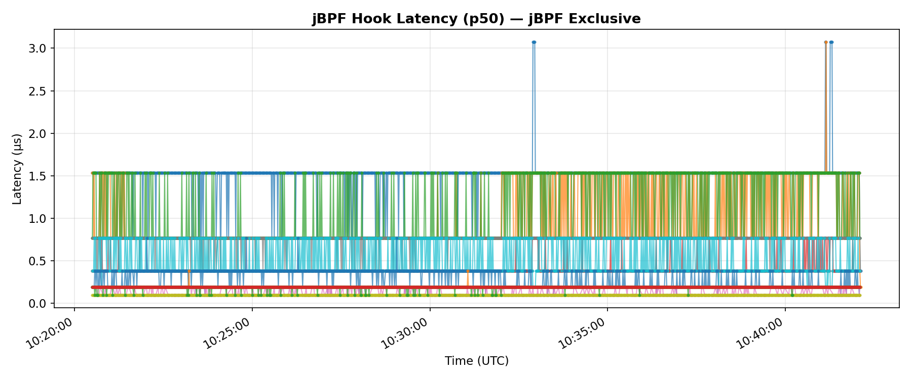

The hooks add microsecond-level overhead to each instrumented function. Under normal operation this is well within the 1 ms slot budget.

| Hook | Invocations/s | p50 (us) | p99 (us) | CPU % |
|------|--------------|----------|----------|-------|
| rlc_ul_sdu_delivered | 880 | 1.56 | 8.31 | 0.73 |
| rlc_ul_rx_pdu | 1,051 | 1.56 | 5.62 | 0.59 |
| pdcp_ul_rx_data_pdu | 880 | 1.61 | 6.30 | 0.55 |
| pdcp_ul_deliver_sdu | 880 | 1.56 | 5.54 | 0.49 |
| fapi_ul_tti_request | 680 | 1.54 | 6.40 | 0.44 |
| fapi_dl_tti_request | 680 | 1.54 | 5.94 | 0.40 |
| rlc_dl_tx_pdu | 55 | 3.06 | 10.53 | 0.06 |
| All other hooks (15) | <10 each | -- | -- | 0.03 |
| **All 22 hooks combined** | | | | **0.79 (measured)** |

**Controlled OFF vs ON experiment (primary result):**

A direct measurement was run using identical traffic (10 Mbps iperf3 UL, 90 s each run) with codelets OFF (jrtc running, zero codelets loaded) vs ON (all 12 codelet sets, ~60 programs). CPU sampled with `pidstat` at 1 s intervals.

| Process | OFF | ON | Delta |
|---|---|---|---|
| gNB | 178.78% | 178.92% | **+0.15%** |
| jrtc | 9.48% | 9.85% | **+0.37%** |
| System (16 cores) | 18.04% | 18.06% | **+0.02%** |

Combined overhead of loading all 60 codelets: **< 0.6% of one core**. The gNB process delta (+0.15%) is within measurement noise. Reproduce: `bash scripts/benchmark_codelet_overhead.sh`

When we demoted the gNB from `SCHED_FIFO:96` to `SCHED_BATCH`, the `fapi_ul_tti_request` p99 jumped to 7,289 us -- over 7x the entire slot budget. Meanwhile, the standard metrics showed only a small MCS/BSR change that could easily be mistaken for normal channel variation. Without hook latency, there is no way to tell a scheduling fault from a fading dip.

### Ping RTT

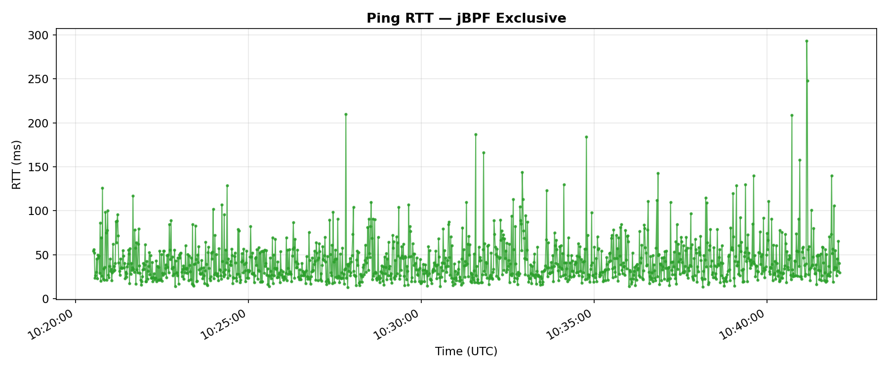

End-to-end round-trip latency via ICMP ping through the full stack (UE -> gNB -> core -> gNB -> UE): 15--65 ms range. No standard equivalent -- the built-in metrics only measure L2 performance, not application-layer latency.

---

## 7. Standard-exclusive metrics

A few metrics are only available through the standard interface:

| Field | What it is |
|---|---|
| `dl_ri` / `ul_ri` | Rank indicator (MIMO layers) |
| `dl_bs` | DL buffer status -- pending bytes in scheduler queue |
| `last_phr` | Last power headroom report from UE |
| `average_latency` / `max_latency` | Cell-level scheduling latency (us) |
| `latency_histogram` | Distribution of scheduling latencies |
| `late_dl_harqs` | Count of late DL HARQ feedback |
| `nof_failed_pdcch_allocs` | Failed PDCCH allocation attempts |
| PUCCH SNR | Control channel SNR (separate from PUSCH) |
| HARQ processing delays | `avg_crc_delay`, `avg_pucch_harq_delay`, `avg_pusch_harq_delay` |

These are mostly useful for radio resource management and scheduler debugging. They could be added to Janus by writing codelets for the relevant call sites.

---

## 8. Capability comparison

| | Standard | Janus |
|---|---|---|
| Setup effort | Low (Docker Compose) | High (jrtc, codelets, proxy, decoder) |
| Update rate | ~1 Hz (1 s aggregates) | ~1 Hz (configurable, per-slot possible) |
| Per-slot (1 ms) visibility | No | Yes |
| Hook execution latency | No | Yes (22 hooks) |
| Per-layer byte counters (RLC/PDCP) | No | Yes |
| RLC SDU delivery latency | No | Yes |
| Per-RACH-attempt SNR + TA | No | Yes |
| RRC/NGAP procedure timing | No | Yes |
| Infrastructure fault detection | No | Yes |
| CQI / Rank Indicator | Yes | Partial (CQI yes, RI no) |
| Scheduling latency histograms | Yes | No |
| PHR / DL buffer status | Yes | No |
| Metric count | ~30 fields in 1 table | 60+ fields across 17 measurements |
| CPU overhead | Negligible | **< 0.6% of one core** (measured) |
| Can be loaded/unloaded at runtime | Always on | Yes (`jrtc-ctl`) |

---

## 9. Takeaway

Where both systems measure the same quantity, their **mean values agree closely**: SINR means differ by 2.1%, DL and UL MCS by 0.1%, BSR by 2.1%, and timing advance by 0.2%. CQI matches exactly (both 15, though this is a srsUE limitation rather than a channel measurement). Throughput differs by ~1.75× between Janus (iperf3 application layer) and the standard system (MAC layer) -- a structural difference from protocol overhead, not a data quality issue. These results validate that the eBPF codelets are extracting correct values from the gNB's internal data structures.

Per-sample **time-series correlation** ranges from near-zero (r ≈ 0.02--0.06 for TA and BSR) to moderate (r = 0.37--0.45 for MCS and SINR). The moderate correlations for SINR and MCS are consistent with two systems that use different aggregation windows (1 s vs 2 s) independently sampling the same fading process. The weak correlations for BSR and TA reflect metrics that are either near-constant (TA) or bursty and timing-sensitive (BSR).

BLER cannot be directly compared because jBPF reports UL CRC failures (10.82%) while the standard reports DL HARQ errors (0.86%). These measure different directions of the radio link. Together they give a complete picture of both link directions that neither system provides alone.

The two channels are complementary. Standard gives a low-overhead overview of radio-layer health. Janus adds three things the standard channel cannot provide:

1. **Hook latency** -- direct measurement of gNB internal processing time, the only way to distinguish infrastructure faults from channel degradation.
2. **Per-slot resolution** -- events shorter than 1 second get averaged away in the standard 1 s aggregate.
3. **Cross-layer tracing** -- a single event like a HARQ failure can be followed from the scheduler through RLC retransmission to PDCP delivery, all time-aligned.

---

## 10. Reproduction

```bash
# Start Docker metrics stack (Telegraf + InfluxDB 3 + Grafana)
cd ~/Desktop/srsRAN_Project_jbpf/docker
docker compose -f docker-compose.yml -f docker-compose.metrics.yml \
  up telegraf influxdb grafana --build -d

# Run the comparison experiment
cd ~/Desktop/srsran-telemetry-pipeline/scripts
bash launch_mac_telemetry.sh --grc --fading --k-factor 1 --snr 18

# Wait ~10 minutes for steady-state, then extract and compare
python3 extract_and_compare.py

# Or run the live side-by-side comparison
python3 compare_jbpf_vs_standard.py

# Dashboards:
#   Janus:    http://localhost:3000
#   Standard: http://localhost:3300
```

---

## 11. Raw data

All extracted data and aligned time series are in the [`data/`](data/) directory as CSV files. The extraction and plotting script is [`scripts/extract_and_compare.py`](../../scripts/extract_and_compare.py).
