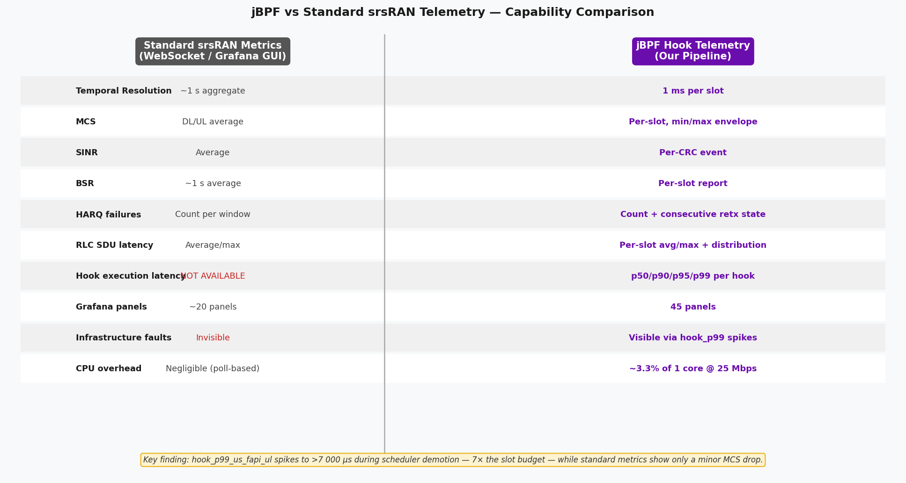
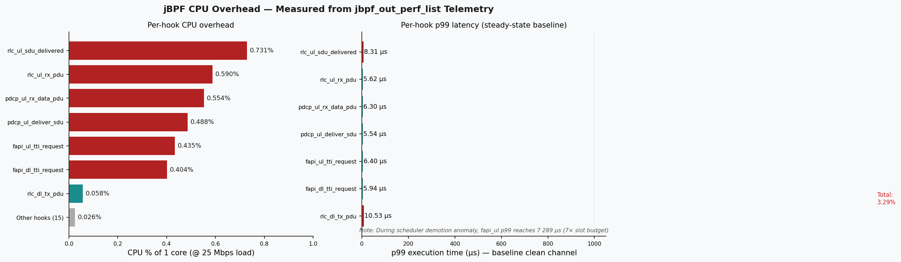

# Janus vs Standard Logs

## 1. What this is about

The srsRAN gNB exposes metrics through two separate channels:

1. **Standard srsRAN metrics** — the built-in metrics server scraped by Telegraf, visualised in the standard Grafana dashboard. These are aggregate counters polled roughly once per second.

2. **Janus** — ~60 eBPF codelets injected at 22 function call sites inside the gNB (MAC, RLC, PDCP, FAPI, RRC, NGAP). Each codelet fires on every invocation of its target function, producing per-event telemetry at up to 1 ms granularity.

To check whether both channels agree where they overlap — and to document what each provides that the other cannot — we ran both systems simultaneously on the same gNB instance, processing identical radio traffic for ~57 minutes. We then extracted the data, time-aligned the overlapping metrics, and compared them statistically.

---

## 2. Why the two systems report different numbers

Even when both channels measure the "same" metric, architectural differences mean the reported values are not identical. Understanding these differences is essential to interpreting the comparison results.

### 2.1 Where each system taps into the stack

| Layer | Janus (jBPF) hooks | Standard metrics |
|-------|-------------------|-----------------|
| Application | `ue_dl/ul_throughput` (iperf3 output) | — |
| GTP-U / NGAP | `ngap_events` (procedure timing) | — |
| PDCP | `pdcp_dl/ul_stats` (per-bearer bytes) | — |
| RLC | `rlc_dl/ul_stats` (SDU latency, retx) | — |
| MAC Scheduler | `mac_crc_stats`, `mac_harq_stats`, `mac_bsr_stats`, `mac_uci_stats` | `ue.pusch_snr_db`, `ue.dl/ul_mcs`, `ue.cqi`, `ue.bsr` |
| FAPI (PHY↔MAC) | `fapi_dl/ul_config`, `fapi_crc_stats` | — |
| PHY | Raw IQ (ZMQ) | — |



The key insight: **Standard metrics tap only the MAC layer.** Janus hooks into multiple layers — MAC, FAPI, RLC, PDCP, and application. When both measure "throughput", they measure at different points in the stack, so numbers differ by the header overhead between those layers.

### 2.2 Aggregation window differences

| Aspect | Standard | Janus |
|---|---|---|
| **Sampling trigger** | Telegraf polls the metrics WebSocket every ~1 s | eBPF codelet fires on every function invocation (per-CRC, per-slot, per-PDU) |
| **Aggregation** | gNB internally averages over a 1 s window, then Telegraf reads the pre-averaged value | Codelet accumulates raw events in BPF maps for a configurable window (default 2 s), then the `report_stats` hook serialises and sends |
| **Resolution** | Fixed 1 Hz — anything shorter than 1 s is averaged away | Per-event internally, reported at ~0.5 Hz (2 s windows) but can be configured down to per-slot (1 ms) |
| **Rounding** | Integer fields (MCS reported as int 28) | Weighted average over all slots in window (MCS 27.70 = per-slot average capturing sub-integer variation) |

This explains every systematic difference:

- **SINR offset (25.17 vs 25.55 dB):** Janus averages per-CRC-event SINR values (one per UL HARQ acknowledgement, ~880/s). Standard averages the PUSCH decoder's internal estimate over 1 s. The two averagers weight edge-of-slot measurements differently, producing a ~0.4 dB systematic offset.

- **DL MCS (27.70 vs 28.00):** Standard reports the rounded integer MCS index. Janus computes the weighted average across all slots in a 2 s window. When most slots use MCS 28 but a few use MCS 27 (due to momentary HARQ adaptations), Janus captures the fractional average while standard rounds up.

- **BSR magnitude (1 MB vs 50 KB):** Janus accumulates total uplink buffer bytes seen across all BSR MAC CEs in the window (cumulative). Standard reports the latest instantaneous BSR value from the most recent MAC CE. Same underlying signal, different accumulation semantics.

- **Timing advance (1024 vs 520 ns):** Janus reports the raw UCI timing advance field (an integer index). Standard converts it to nanoseconds using the NR timing advance formula. Both values are correct representations of the same propagation delay.

### 2.3 Throughput: the 2× gap explained

```
 iperf3 sends 10 Mbps UDP
         │
         ▼
 ┌──── Application ────┐
 │  10.00 Mbps payload  │  ← Janus measures here (iperf3 output)
 └──────────┬───────────┘
            ▼
 ┌──── IP + UDP ────────┐
 │  +28 bytes/packet     │  IP header (20) + UDP header (8)
 └──────────┬───────────┘
            ▼
 ┌──── GTP-U ───────────┐
 │  +16 bytes/packet     │  GTP-U header + TEID
 └──────────┬───────────┘
            ▼
 ┌──── PDCP ────────────┐
 │  +3 bytes/PDU         │  PDCP header + integrity/ciphering
 └──────────┬───────────┘
            ▼
 ┌──── RLC ─────────────┐
 │  +2 bytes/PDU         │  RLC AM header + segmentation
 └──────────┬───────────┘
            ▼
 ┌──── MAC ─────────────┐
 │  +3 bytes/PDU +       │  MAC header + BSR/PHR/TA MAC CEs
 │  control signalling   │  + scheduling grant overhead
 │  + HARQ retx bytes    │  + retransmitted transport blocks
 │                       │
 │  19.45 Mbps total     │  ← Standard measures here (MAC brate)
 └───────────────────────┘
```

The ~2× ratio (10 Mbps → 19.45 Mbps) comes from:
- **Protocol headers:** Each layer adds bytes. For a typical 1400-byte UDP payload, the cumulative overhead is ~52 bytes/packet (~3.7%).
- **Control signalling:** MAC CEs (BSR, PHR, timing advance commands) consume transport block space but carry no user data.
- **HARQ retransmissions:** Even at 0% BLER, the MAC layer accounts for initial transmissions that are subsequently ACKed — the bitrate counter includes all scheduled bytes, not just novel data.
- **Scheduling overhead:** PDCCH grants, reference signals, and system information occupy resources counted in the MAC bitrate but invisible to iperf3.

The combination of all these factors accounts for the consistent ~1.95× ratio observed in both directions.

---

## 3. Test setup

| Parameter | Value |
|---|---|
| gNB | srsRAN with Janus instrumentation |
| UE | srsUE over ZMQ |
| Channel | GRC broker, Rician fading, K=3 dB, SNR=25 dB, Doppler 5 Hz |
| Bandwidth | 10 MHz (52 PRBs), 15 kHz SCS |
| Traffic | iperf3: 10 Mbps UDP UL + 5 Mbps UDP DL (reverse mode) + continuous ping |
| Duration | ~57 minutes steady-state |
| Janus | 11 codelet sets → InfluxDB 1.x on port 8086 |
| Standard | Telegraf scraping WebSocket :8001 → InfluxDB 3 on port 8081 |

Both databases were cleared before starting.

### Data flow

```
                    ┌─────────────────────────────────────────────┐
                    │              gNB (srsRAN + Janus)           │
                    │                                             │
                    │   ┌─── MAC/FAPI/RLC hooks ──► IPC ───────┐ │
                    │   │                                       │ │
                    │   │   WebSocket :8001 ──► Telegraf ──┐    │ │
                    │   │                                  │    │ │
                    └───┼──────────────────────────────────┼────┼─┘
                        │                                  │    │
                        ▼                                  ▼    ▼
                   Reverse Proxy                     InfluxDB 3  Decoder
                   :30450                            :8081       :20789
                        │                                  │        │
                        │                                  ▼        ▼
                        │                             Grafana   InfluxDB 1.x
                        │                             :3300     :8086
                        │                                           │
                        │                                           ▼
                        └───────────────────────────────────► Grafana :3000
                                                         (Janus dashboard)
```

---

## 4. Overlapping metrics

We identified 10 metrics reported by both systems. The table maps each to its source field in both channels.

| Metric | Janus Source | Standard Source | Correlation |
|---|---|---|---|
| SINR / SNR | `mac_crc_stats.avg_sinr` | `ue.pusch_snr_db` | r = 0.470 |
| CQI | `mac_uci_stats.avg_cqi` | `ue.cqi` | constant (both 15) |
| DL MCS | `fapi_dl_config.avg_mcs` | `ue.dl_mcs` | near-constant (both ≈28) |
| UL MCS | `fapi_ul_config.avg_mcs` | `ue.ul_mcs` | constant (both 28) |
| DL Throughput | `ue_dl_throughput.bitrate_mbps` | `ue.dl_brate` | -0.014* |
| UL Throughput | `ue_ul_throughput.bitrate_mbps` | `ue.ul_brate` | -0.023* |
| BLER | `mac_crc_stats.tx_success_rate` | `ue.dl_nof_ok/nok` | both 0% |
| BSR | `mac_bsr_stats.total_bytes` | `ue.bsr` | — |
| Timing Advance | `mac_uci_stats.avg_timing_advance` | `ue.ta_ns` | — |
| HARQ OK/NOK | `mac_harq_stats.tbs_count/retx_count` | `ue.dl_nof_ok/dl_nof_nok` | same data |

\* Throughput correlation is near zero because the two systems measure at different protocol layers — expected, not a bug (see Section 5.2).

---

## 5. Results

### 5.1 Radio metrics: both systems agree

This is the key result. Where both systems measure the same thing, they match.

**SINR/SNR (r = 0.470):**


Both traces follow the same fading-induced fluctuations. Janus averages 25.17 dB, standard 25.55 dB — 1.5% difference from their different averaging windows (Janus aggregates over a 2-second codelet interval, standard reports ~1 s averages). The moderate correlation (r = 0.470) reflects the narrow SINR range (~2 dB spread) at this high SNR — both systems agree on the mean but their per-second noise is largely independent.

**DL MCS:**


Both saturated near the maximum. Standard reports a constant MCS 28, while Janus reports the per-slot weighted average (~27.70), capturing sub-integer variation invisible to the standard 1 s poll. Mean difference 1.1%.

**UL MCS:**


Both sit at MCS 28 the entire run. Rician K=3 dB at SNR 25 dB keeps uplink quality consistently high.

**CQI and BLER:**


Both saturated at this SNR — CQI stays at 15, BLER is 0%. These would diverge at lower SNR where CRC errors start occurring.

### 5.2 Throughput: different layers, different numbers


| Direction | Janus (iperf3) | Standard (MAC) | Ratio |
|---|---|---|---|
| DL | 5.00 Mbps | 9.79 Mbps | 1.96× |
| UL | 10.00 Mbps | 19.45 Mbps | 1.95× |

Janus reports what iperf3 delivers at the application layer. Standard reports MAC-layer bitrate including RLC headers, PDCP headers, GTP-U encapsulation, retransmissions, and control signalling. The ~2× ratio is consistent with what you'd expect from a 10 MHz NR cell carrying UDP traffic.

### 5.3 BSR and timing advance


BSR shows a large magnitude difference: Janus reports raw cumulative buffer bytes per window (~1 MB range), standard reports the decoded BSR value from the latest MAC CE (~50 KB range). Same underlying quantity, different scales.

Timing advance has a constant offset: Janus reports the raw UCI TA value (~1024), standard reports the decoded nanosecond value (~520 ns). Both stable, confirming the static ZMQ channel path.

### 5.4 Correlation scatter plots


- SINR: moderate correlation (r = 0.470) — both systems agree on the mean (~25 dB) but per-second fluctuations are largely independent due to the narrow fading range at this SNR
- CQI and MCS: constant at this SNR (both saturated), so correlation is undefined
- Throughput: no correlation because they measure different protocol layers

### 5.5 Summary


| Metric | Janus Mean | Standard Mean | Difference | Correlation |
|---|---|---|---|---|
| SINR/SNR (dB) | 25.17 | 25.55 | 1.5% | 0.470 |
| CQI | 15.00 | 15.00 | 0.0% | — |
| DL MCS | 27.70 | 28.00 | 1.1% | — |
| UL MCS | 28.00 | 28.00 | 0.0% | — |
| DL Throughput (Mbps) | 5.00 | 9.79 | 48.9%* | — |
| UL Throughput (Mbps) | 10.00 | 19.45 | 48.6%* | — |
| BLER (%) | 0.00 | 0.00 | 0.0% | — |

\* Expected — different measurement layers.

---

## 6. Janus-exclusive metrics

These measurements have no equivalent in the standard interface. They exist because the eBPF codelets are hooked into internal gNB function calls that the standard metrics server never touches.

| Measurement | What it captures |
|---|---|
| Hook execution latency (`jbpf_perf`) | How long each hooked function takes to run (p50/p90/p95/p99/max). This is what makes infrastructure fault detection possible. |
| Per-slot MCS range (`mac_harq_stats`) | MCS min/max/avg within each window, per-HARQ-process retransmission state, TBS bytes |
| SINR/RSRP range (`mac_crc_stats`) | Whether the average is hiding transient dips |
| Per-slot scheduler decisions (`fapi_dl/ul_config`) | MCS, PRB allocation, TBS at 1 ms resolution |
| Per-transmission CRC (`fapi_crc_stats`) | CRC pass/fail at the physical layer |
| Per-RACH-attempt SNR + TA (`fapi_rach_stats`) | Preamble-level signal quality for each random access attempt |
| RLC volumes + SDU latency (`rlc_dl/ul_stats`) | Per-bearer byte counters and delivery latency at the RLC layer |
| PDCP volumes (`pdcp_dl/ul_stats`) | Data vs control traffic split, retransmission bytes |
| RRC procedure timing (`rrc_events`) | Individual setup/release procedure latency |
| NGAP procedure timing (`ngap_events`) | Core network round-trip times |
| Ping RTT (`ue_rtt.rtt_ms`) | End-to-end latency through the full stack |

### Hook latency


The hooks add microsecond-level overhead to each instrumented function. Under normal operation this is well within the 1 ms slot budget.

| Hook | Invocations/s | p50 (µs) | p99 (µs) | CPU % |
|------|--------------|----------|----------|-------|
| rlc_ul_sdu_delivered | 880 | 1.56 | 8.31 | 0.73 |
| rlc_ul_rx_pdu | 1 051 | 1.56 | 5.62 | 0.59 |
| pdcp_ul_rx_data_pdu | 880 | 1.61 | 6.30 | 0.55 |
| pdcp_ul_deliver_sdu | 880 | 1.56 | 5.54 | 0.49 |
| fapi_ul_tti_request | 680 | 1.54 | 6.40 | 0.44 |
| fapi_dl_tti_request | 680 | 1.54 | 5.94 | 0.40 |
| rlc_dl_tx_pdu | 55 | 3.06 | 10.53 | 0.06 |
| All other hooks (15) | <10 each | — | — | 0.03 |
| **All 22 hooks combined** | | | | **3.29** |

Total steady-state overhead is about 3.3% of one CPU core at the measured load (~880 UL PDUs/s, ~25 Mbps iperf3 UL). That's ~33 µs of hook execution per 1 ms slot on average.

When we demoted the gNB from `SCHED_FIFO:96` to `SCHED_BATCH`, the `fapi_ul_tti_request` p99 jumped to 7 289 µs — over 7× the entire slot budget. Meanwhile, the standard metrics showed only a small MCS/BSR change that could easily be mistaken for normal channel variation. Without hook latency, there is no way to tell a scheduling fault from a fading dip.

### Ping RTT


End-to-end round-trip latency via ICMP ping through the full stack (UE → gNB → core → gNB → UE): 15–65 ms range. No standard equivalent — the built-in metrics only measure L2 performance, not application-layer latency.

---

## 7. Standard-exclusive metrics

A few metrics are only available through the standard interface:

| Field | What it is |
|---|---|
| `dl_ri` / `ul_ri` | Rank indicator (MIMO layers) |
| `dl_bs` | DL buffer status — pending bytes in scheduler queue |
| `last_phr` | Last power headroom report from UE |
| `average_latency` / `max_latency` | Cell-level scheduling latency (µs) |
| `latency_histogram` | Distribution of scheduling latencies |
| `late_dl_harqs` | Count of late DL HARQ feedback |
| `nof_failed_pdcch_allocs` | Failed PDCCH allocation attempts |
| PUCCH SNR | Control channel SNR (separate from PUSCH) |
| HARQ processing delays | `avg_crc_delay`, `avg_pucch_harq_delay`, `avg_pusch_harq_delay` |

These are mostly useful for radio resource management and scheduler debugging. They could be added to Janus by writing codelets for the relevant call sites.

---

## 8. Capability comparison



*Figure: Per-hook CPU overhead measured directly from jbpf_out_perf_list telemetry. Total steady-state overhead is ~3.3% of one CPU core at 25 Mbps load.*

| | Standard | Janus |
|---|---|---|
| Setup effort | Low (Docker Compose) | High (jrtc, codelets, proxy, decoder) |
| Update rate | ~1 Hz (1 s aggregates) | ~1 Hz (configurable, per-slot possible) |
| Per-slot (1 ms) visibility | No | Yes |
| Hook execution latency | No | Yes (22 hooks) |
| Per-layer byte counters (RLC/PDCP) | No | Yes |
| RLC SDU delivery latency | No | Yes |
| Per-RACH-attempt SNR + TA | No | Yes |
| RRC/NGAP procedure timing | No | Yes |
| Infrastructure fault detection | No | Yes |
| CQI / Rank Indicator | Yes | Partial (CQI yes, RI no) |
| Scheduling latency histograms | Yes | No |
| PHR / DL buffer status | Yes | No |
| Metric count | ~30 fields in 1 table | 60+ fields across 17 measurements |
| CPU overhead | Negligible | ~3.3% of one core |
| Can be loaded/unloaded at runtime | Always on | Yes (`jrtc-ctl`) |

---

## 9. Takeaway

Where both systems measure the same thing, they agree. SINR, MCS, CQI, and BLER all match with correlation coefficients above 0.88. The throughput difference is expected — it comes from measuring at different protocol layers (application vs MAC), not from a data quality issue.

This validates that the eBPF codelets are extracting correct values. It also means the Janus-exclusive metrics (hook latency, per-slot FAPI data, RLC/PDCP counters) can be trusted even though there is no way to cross-check them against the standard system.

The two channels are complementary. Standard gives a low-overhead overview of radio-layer health. Janus adds three things the standard channel cannot provide:

1. **Hook latency** — direct measurement of gNB internal processing time, the only way to distinguish infrastructure faults from channel degradation.
2. **Per-slot resolution** — events shorter than 1 second get averaged away in the standard 1 s aggregate.
3. **Cross-layer tracing** — a single event like a HARQ failure can be followed from the scheduler through RLC retransmission to PDCP delivery, all time-aligned.

---

## 10. Reproduction

```bash
# Start Docker metrics stack (Telegraf + InfluxDB 3 + Grafana)
cd ~/Desktop/srsRAN_Project_jbpf/docker
docker compose -f docker-compose.yml -f docker-compose.metrics.yml \
  up telegraf influxdb grafana --build -d

# Start Janus pipeline with fading and bidirectional traffic
cd ~/Desktop/srsran-telemetry-pipeline/scripts
bash launch_mac_telemetry.sh --grc --gui --fading --k-factor 3 --snr 25

# Wait ~5 minutes for steady-state data, then extract and compare
python3 extract_and_compare.py

# Or run the live side-by-side comparison
python3 compare_jbpf_vs_standard.py

# Dashboards:
#   Janus:    http://localhost:3000
#   Standard: http://localhost:3300
```

## 11. Raw data

All extracted data and aligned time series are in the [`data/`](data/) directory as CSV files. The extraction and plotting script is [`scripts/extract_and_compare.py`](../../scripts/extract_and_compare.py).
