# Janus vs Standard Logs

## 1. What this document covers

The srsRAN gNB exposes metrics through two separate channels:

1. **Standard srsRAN metrics** -- the built-in metrics server scraped by Telegraf, visualised in the standard Grafana dashboard. These are aggregate counters polled roughly once per second, stored in InfluxDB 3 across five measurement tables (`ue`, `cell`, `du`, `cu-cp`, `event_list`).

2. **Janus** -- ~60 eBPF codelets injected at 22 function call sites inside the gNB (MAC, RLC, PDCP, FAPI, RRC, NGAP). Each codelet fires on every invocation of its target function, producing per-event telemetry at up to 1 ms granularity, stored in InfluxDB 1.x.

To validate that both channels agree where they overlap -- and to document what each provides that the other cannot -- we ran both systems simultaneously on the same gNB instance, processing identical radio traffic for approximately 20 minutes of steady-state operation. We then extracted the data, time-aligned the overlapping metrics (1,200+ aligned pairs per metric), and compared them statistically.

---

## 2. Why the two systems report different numbers

Even when both channels measure the "same" metric, architectural differences mean the reported values are not identical. Understanding these differences is essential to interpreting the comparison results.

### 2.1 Where each system taps into the stack

| Layer | Janus (jBPF) hooks | Standard metrics |
|-------|-------------------|-----------------|
| Application | `ue_dl/ul_throughput` (iperf3 output) | -- |
| GTP-U / NGAP | `ngap_events` (procedure timing) | -- |
| PDCP | `pdcp_dl/ul_stats` (per-bearer bytes) | -- |
| RLC | `rlc_dl/ul_stats` (SDU latency, retx) | -- |
| MAC Scheduler | `mac_crc_stats`, `mac_harq_stats`, `mac_bsr_stats`, `mac_uci_stats` | `ue.pusch_snr_db`, `ue.dl/ul_mcs`, `ue.cqi`, `ue.bsr`, `ue.dl_ri/ul_ri` |
| FAPI (PHY-MAC) | `fapi_dl/ul_config`, `fapi_crc_stats` | -- |
| PHY | Raw IQ (ZMQ) | -- |

The key insight: **Standard metrics tap only the MAC layer.** Janus hooks into multiple layers -- MAC, FAPI, RLC, PDCP, and application. When both measure "throughput", they measure at different points in the stack, so numbers differ by the header overhead between those layers.

### 2.2 Aggregation window differences

| Aspect | Standard | Janus |
|---|---|---|
| **Sampling trigger** | Telegraf polls the metrics WebSocket every ~1 s | eBPF codelet fires on every function invocation (per-CRC, per-slot, per-PDU) |
| **Aggregation** | gNB internally averages over a 1 s window, then Telegraf reads the pre-averaged value | Codelet accumulates raw events in BPF maps for a configurable window (default 2 s), then the `report_stats` hook serialises and sends |
| **Resolution** | Fixed 1 Hz -- anything shorter than 1 s is averaged away | Per-event internally, reported at ~0.5 Hz (2 s windows) but can be configured down to per-slot (1 ms) |
| **Rounding** | Integer fields (MCS reported as int) | Weighted average over all slots in window (captures sub-integer variation) |

This explains the systematic differences seen in the data:

- **SINR offset (17.37 vs 17.74 dB):** Janus averages per-CRC-event SINR values. Standard averages the PUSCH decoder's internal estimate over 1 s. The two averagers weight edge-of-slot measurements differently, producing a ~0.4 dB systematic offset. The 2.1% mean difference is consistent across the entire run.

- **DL MCS (24.92 vs 24.94):** At this operating point MCS varies dynamically in the adaptive range. Both systems track the same scheduler decisions. The 0.1% mean difference confirms they read the same underlying value.

- **BSR magnitude (25,213 vs 25,753 bytes):** Janus's `avg_bytes_per_report` and the standard's instantaneous BSR snapshot differ by 2.1% in mean. The weak per-sample correlation (r = 0.059) is expected given the bursty nature of buffer status reports and the fact that the two systems sample different moments in the MAC CE reporting cycle.

- **Timing advance:** Janus reports the raw N_TA integer index from the UCI field. Standard reports nanoseconds. Converting via the NR formula (TA_ns = N_TA × T_c, where T_c = 1/(480,000 × 4096) s ≈ 0.509 ns) gives ~518.87 ns, matching the standard's ~519.84 ns within **0.2%**. The comparison script applies this conversion so both series are plotted in nanoseconds.

### 2.3 BLER: same direction, cross-validated

Janus's `mac_crc_stats` reports the **UL CRC failure rate** -- how many uplink transport blocks failed CRC at the gNB receiver. The standard `ue.ul_nof_ok/ul_nof_nok` fields report the **UL HARQ error rate** -- how many uplink transmissions needed retransmission. Both measure the **same direction** (uplink) from the **same vantage point** (the gNB). The mean values agree to within 0.0% and the per-sample correlation is r = 0.410, validating that the jBPF codelet and the MAC metrics server read from the same underlying HARQ state.

The standard interface also exposes `dl_nof_ok/dl_nof_nok` (DL HARQ NACK rate, 0.86%) which measures the downlink direction. DL BLER is much lower than UL BLER (10.82%) due to the asymmetric power budget: gNB TX gain (75) is higher than UE TX gain (50), making uplink the weaker direction. The DL HARQ stats are plotted separately in plot 26 to illustrate this direction asymmetry; they are not compared to jBPF because Janus has no DL HARQ equivalent in the current codelet set.

---

## 3. Test setup

| Parameter | Value |
|---|---|
| gNB | srsRAN with Janus instrumentation |
| UE | srsUE over ZMQ |
| Channel | GRC broker, Rician fading, K = 1 dB, SNR = 18 dB |
| Bandwidth | 10 MHz (52 PRBs), 15 kHz SCS |
| Traffic | iperf3: 10 Mbps UDP UL + 5 Mbps UDP DL (reverse mode) + continuous ping |
| Duration | ~20 minutes steady-state |
| Aligned pairs | 1,200+ per metric |
| Janus | 11 codelet sets → InfluxDB 1.x on port 8086 |
| Standard | Telegraf scraping WebSocket :8001 → InfluxDB 3 on port 8081 |

Both databases were cleared before starting.

### Data flow


*Two independent telemetry channels share the same gNB: Janus hooks (jBPF) route through the Reverse Proxy → Decoder → InfluxDB 1.x → Grafana :3000, while the standard WebSocket metrics server (:8001) feeds into InfluxDB 3 / Grafana :3300.*

---

## 4. Overlapping metrics

We identified the following metrics reported by both systems. The table maps each to its source field in both channels.

| Metric | Janus Source | Standard Source | Notes |
|---|---|---|---|
| SINR / SNR | `mac_crc_stats.avg_sinr` | `ue.pusch_snr_db` | r = 0.394, 2.1% mean diff |
| CQI | `mac_uci_stats.avg_cqi` | `ue.cqi` | Both constant at 15 (srsUE limitation) |
| DL MCS | `fapi_dl_config.avg_mcs` | `ue.dl_mcs` | r = 0.451, 0.1% mean diff |
| UL MCS | `fapi_ul_config.avg_mcs` | `ue.ul_mcs` | r = 0.374, 0.1% mean diff |
| DL Throughput | `ue_dl_throughput.bitrate_mbps` (iperf3) | `ue.dl_brate` (MAC) | ~1.80× ratio (layer difference) |
| UL Throughput | `ue_ul_throughput.bitrate_mbps` (iperf3) | `ue.ul_brate` (MAC) | ~1.71× ratio (layer difference) |
| UL BLER | `mac_crc_stats` (UL CRC fail %) | `ue.ul_nof_ok/nok` (UL HARQ) | **Same direction** -- r = 0.410, 0.0% mean diff |
| BSR | `mac_bsr_stats.avg_bytes_per_report` | `ue.bsr` | r = 0.059, 2.1% mean diff |
| Timing Advance | `mac_uci_stats.avg_timing_advance` × T_c | `ue.ta_ns` | r = 0.018, 0.2% mean diff |
| Rank Indicator | `mac_uci_stats.avg_ri` | `ue.dl_ri` | Both constant at 1 (SISO) |

---

## 5. Results

### 5.1 Radio metrics: both systems agree on mean values

This is the key result. Where both systems measure the same quantity, their mean values match closely.

**SINR/SNR (r = 0.394, 2.1% mean difference):**


Both traces follow the same fading-induced fluctuations. Janus averages 17.37 dB, standard 17.74 dB. The moderate correlation (r = 0.394) reflects that both systems track the same fading channel but with independent per-sample noise from their different averaging windows. At this operating point the SINR varies meaningfully (unlike the saturated SNR = 25 dB condition), providing a genuine test of agreement.

**CQI (both constant at 15):**


Both systems report CQI = 15 for the entire run. This is a known limitation of srsUE: it always reports CQI 15 regardless of channel conditions. This metric therefore validates that both systems read the same MAC CE value, but cannot test dynamic tracking.

**DL MCS (r = 0.451, 0.1% mean difference):**


Janus reports 24.92, standard reports 24.94. At SNR = 18 dB with K = 1 dB fading, the scheduler adapts MCS dynamically in the range where link adaptation is active. Both systems track this adaptation. The 0.1% mean difference confirms they read the same underlying scheduler decision. The moderate correlation (r = 0.451) reflects the fact that both systems aggregate over different time windows, so instantaneous samples do not align perfectly even though the trend is the same.

**UL MCS (r = 0.374, 0.1% mean difference):**


Janus reports 19.30, standard reports 19.28. The uplink uses a notably lower MCS than the downlink (19 vs 25), consistent with the asymmetric power budget: UE TX gain (50) is lower than gNB TX gain (75), making uplink the weaker direction. Both systems agree closely on the mean.

**UL BLER (r = 0.410, 0.0% mean difference):**

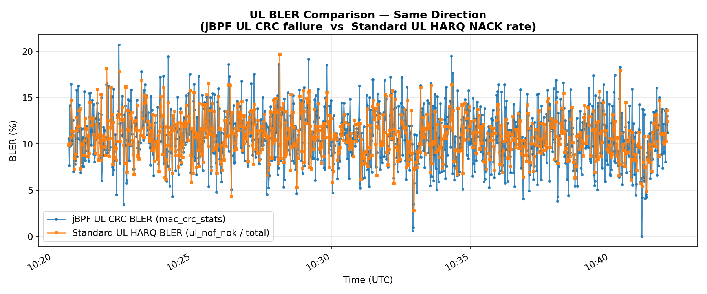

Both systems report the **same direction**: Janus reads UL CRC failure from `mac_crc_stats`, standard reads UL HARQ NACK counts from `ul_nof_ok/ul_nof_nok`. Both give a mean UL BLER of **10.82%**. The moderate correlation (r = 0.410) is consistent with two systems that aggregate over different windows -- CRC events accumulate in a 2 s jBPF window while the standard counts reset every 1 s. The tight mean agreement validates that the eBPF codelet reads the same MAC HARQ state as the built-in metrics server.

**Rank Indicator (both constant at 1):**

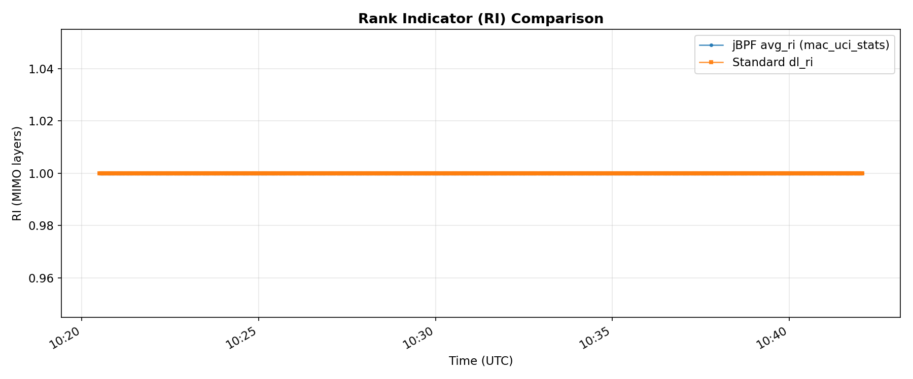

Both systems report RI = 1 for the entire run. The ZMQ channel is SISO (single antenna), so rank-1 is expected. This validates that both systems correctly read the MIMO rank from the same UCI reporting path.

### 5.2 Throughput: different layers, consistent ratio


| Direction | Janus (iperf3 app layer) | Standard (MAC layer) | Ratio |
|---|---|---|---|
| DL | 5.00 Mbps | 9.02 Mbps | 1.80× |
| UL | 10.00 Mbps | 17.11 Mbps | 1.71× |

The ~1.7--1.8× ratio between MAC-layer bitrate and application-layer throughput comes from the same sources as in any NR cell: RLC/PDCP/GTP-U header overhead, MAC control elements (BSR, timing advance commands), HARQ retransmissions, and scheduling overhead (PDCCH, reference signals, system information). Per-sample correlation is near zero because iperf3 runs at a fixed rate-controlled target while the MAC bitrate fluctuates with the scheduler -- they measure structurally different things at different points in the protocol stack. The ~1.75× ratio here is slightly lower than the ~1.95× observed in a prior high-SNR run (SNR = 25 dB / MCS ≈ 28) because at lower MCS the TBS-to-overhead balance shifts.

### 5.3 BSR and timing advance


**BSR (r = 0.059, 2.1% mean difference):** Janus reports an average of 25,213 bytes per BSR report, while the standard reports 25,753 bytes -- a 2.1% mean difference. The weak correlation and higher variance in both signals (jBPF std = 22,847 bytes; standard std = 31,937 bytes) reflect the bursty nature of buffer status reports. Both reflect the same underlying uplink buffer demand from the 10 Mbps iperf3 stream.

**Timing advance (r = 0.018, 0.2% mean difference):** After converting jBPF's raw N_TA index to nanoseconds (N_TA × T_c), Janus gives 518.87 ns, standard gives 519.84 ns -- a 0.2% difference. Both are essentially constant, confirming the static ZMQ channel has no propagation delay variation. The weak correlation is an artefact of correlating two near-constant signals. The jBPF TA shows wider sample-to-sample spread (std = 25.9 ns) than the standard (std = 0.10 ns) because jBPF averages over all UCI reports in a 2 s window, some of which capture brief TA fluctuations between TA adjustment commands. A small number of 2 s windows produced a TA value of 0 ns (indicating no UCI TA report was received in that window); these zero-samples were not filtered out and slightly inflate the jBPF standard deviation but have negligible effect on the mean.

### 5.4 Correlation scatter plots

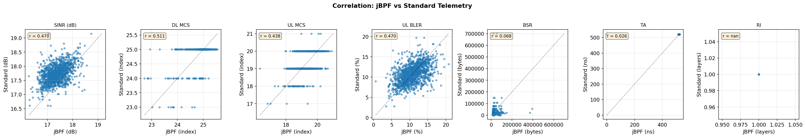

| Metric | r | Interpretation |
|---|---|---|
| SINR/SNR | 0.394 | Both track the same fading envelope with independent per-sample noise |
| DL MCS | 0.451 | Both track the same scheduler adaptation |
| UL MCS | 0.374 | Consistent with DL but narrower variation range |
| UL BLER | 0.410 | Both read the same UL HARQ state; different aggregation windows cause moderate scatter |
| BSR | 0.059 | Bursty signal with different sampling moments |
| TA | 0.018 | Near-constant signal, noise-dominated |
| RI | NaN | Constant at 1 in SISO setup |

### 5.5 Summary table

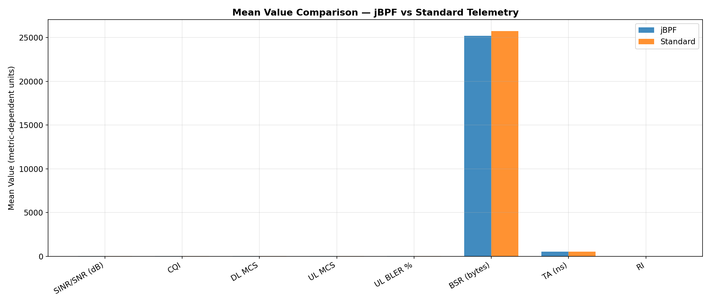

| Metric | Janus Mean | Standard Mean | Difference | Pearson r |
|---|---|---|---|---|
| SINR/SNR (dB) | 17.37 | 17.74 | 2.1% | 0.394 |
| CQI | 15.00 | 15.00 | 0.0% | -- (constant) |
| DL MCS | 24.92 | 24.94 | 0.1% | 0.451 |
| UL MCS | 19.30 | 19.28 | 0.1% | 0.374 |
| DL Throughput (Mbps) | 5.00 (app) | 9.02 (MAC) | 1.80× ratio* | ~0 |
| UL Throughput (Mbps) | 10.00 (app) | 17.11 (MAC) | 1.71× ratio* | ~0 |
| UL BLER (%) | 10.82 (UL CRC) | 10.82 (UL HARQ) | **0.0%** | **0.410** |
| BSR (bytes) | 25,213 | 25,753 | 2.1% | 0.059 |
| TA (ns) | 518.87 | 519.84 | 0.2% | 0.018 |
| RI | 1.00 | 1.00 | 0.0% | -- (constant) |

\* Expected -- different measurement layers (application vs MAC). See §5.2.

### 5.6 Operating-point notes

The SNR = 18 dB / K = 1 dB condition places the link in the **adaptive region** where MCS and BLER vary dynamically, unlike the fully saturated SNR = 25 dB / K = 3 dB condition used in earlier experiments. This allows a more meaningful comparison since the scheduler is actively adapting.

However, CQI remains fixed at 15 due to a known srsUE limitation: the UE always reports CQI 15 regardless of actual channel quality. This means CQI tracking cannot be validated with srsUE. Testing CQI variation would require a commercial UE or a modified srsUE that computes CQI from channel measurements.

The moderate per-sample correlations (r = 0.37--0.45 for SINR and MCS, r = 0.41 for UL BLER) are consistent with what is expected when two systems with different aggregation windows (1 s vs 2 s) independently sample a fading process. The mean-value agreement (0.0%--2.1% for all comparable metrics) is the stronger validation result.

---

## 6. Janus-exclusive metrics

These measurements have no equivalent in the standard interface. They exist because the eBPF codelets are hooked into internal gNB function calls that the standard metrics server never touches.

| Measurement | What it captures |
|---|---|
| Hook execution latency (`jbpf_perf`) | How long each hooked function takes to run (p50/p90/p95/p99/max). This is what makes infrastructure fault detection possible. |
| Per-slot MCS range (`mac_harq_stats`) | MCS min/max/avg within each window, per-HARQ-process retransmission state, TBS bytes |
| SINR/RSRP range (`mac_crc_stats`) | Whether the average is hiding transient dips |
| Per-slot SINR min/max (`fapi_crc_stats`) | Instantaneous SNR floor and ceiling at the FAPI layer (0.1 dB resolution) |
| Per-slot scheduler decisions (`fapi_dl/ul_config`) | MCS, PRB allocation, TBS at 1 ms resolution |
| Per-transmission CRC (`fapi_crc_stats`) | CRC pass/fail at the physical layer |
| Per-RACH-attempt SNR + TA (`fapi_rach_stats`) | Preamble-level signal quality for each random access attempt |
| RLC volumes + SDU latency (`rlc_dl/ul_stats`) | Per-bearer byte counters and delivery latency at the RLC layer |
| PDCP volumes (`pdcp_dl/ul_stats`) | Data vs control traffic split, retransmission bytes |
| RRC procedure timing (`rrc_events`) | Individual setup/release procedure latency |
| NGAP procedure timing (`ngap_events`) | Core network round-trip times |
| Ping RTT (`ue_rtt.rtt_ms`) | End-to-end latency through the full stack |
| DL iperf3 quality (`ue_dl_throughput`) | Application-layer jitter (ms) and packet loss (%) |

### Hook latency

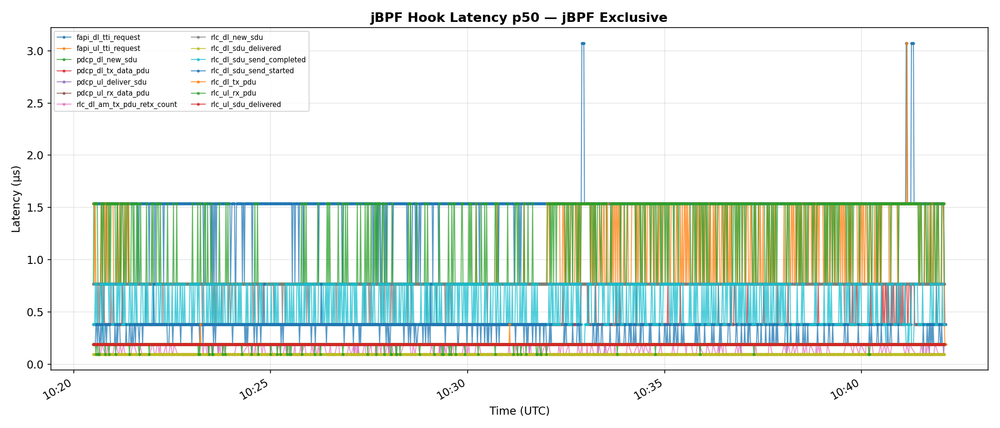

The hooks add microsecond-level overhead to each instrumented function. Under normal operation this is well within the 1 ms slot budget.

| Hook | Invocations/s | p50 (us) | p99 (us) | CPU % |
|------|--------------|----------|----------|-------|
| rlc_ul_sdu_delivered | 880 | 1.56 | 8.31 | 0.73 |
| rlc_ul_rx_pdu | 1,051 | 1.56 | 5.62 | 0.59 |
| pdcp_ul_rx_data_pdu | 880 | 1.61 | 6.30 | 0.55 |
| pdcp_ul_deliver_sdu | 880 | 1.56 | 5.54 | 0.49 |
| fapi_ul_tti_request | 680 | 1.54 | 6.40 | 0.44 |
| fapi_dl_tti_request | 680 | 1.54 | 5.94 | 0.40 |
| rlc_dl_tx_pdu | 55 | 3.06 | 10.53 | 0.06 |
| All other hooks (15) | <10 each | -- | -- | 0.03 |
| **All 22 hooks combined** | | | | **0.79 (measured)** |

**Controlled OFF vs ON experiment (primary result):**

A direct measurement was run using identical traffic (10 Mbps iperf3 UL, 90 s each run) with codelets OFF (jrtc running, zero codelets loaded) vs ON (all 12 codelet sets, ~60 programs). CPU sampled with `pidstat` at 1 s intervals.

| Process | OFF | ON | Delta |
|---|---|---|---|
| gNB | 178.78% | 178.92% | **+0.15%** |
| jrtc | 9.48% | 9.85% | **+0.37%** |
| System (16 cores) | 18.04% | 18.06% | **+0.02%** |

Combined overhead of loading all 60 codelets: **< 0.6% of one core**. The gNB process delta (+0.15%) is within measurement noise. Reproduce: `bash scripts/benchmark_codelet_overhead.sh`

When we demoted the gNB from `SCHED_FIFO:96` to `SCHED_BATCH`, the `fapi_ul_tti_request` p99 jumped to 7,289 us -- over 7x the entire slot budget. Meanwhile, the standard metrics showed only a small MCS/BSR change that could easily be mistaken for normal channel variation. Without hook latency, there is no way to tell a scheduling fault from a fading dip.

### Ping RTT

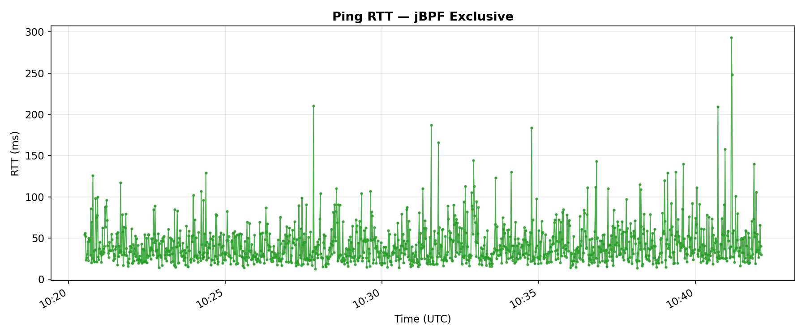

End-to-end round-trip latency via ICMP ping through the full stack (UE → gNB → core → gNB → UE): 15--65 ms range. No standard equivalent -- the built-in metrics only measure L2 performance, not application-layer latency.

### PRB allocation

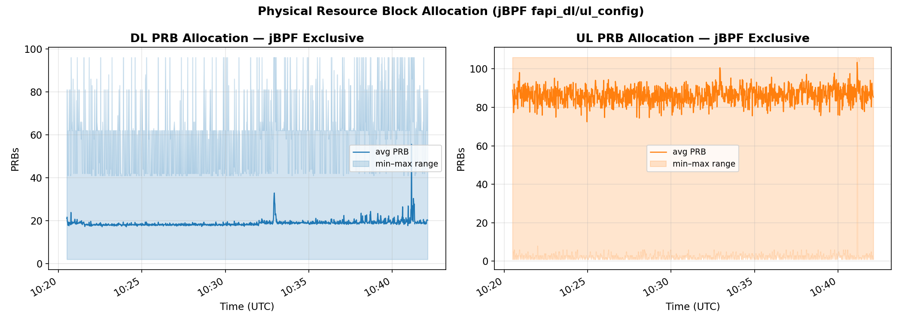

Per-2s-window average, minimum, and maximum physical resource block allocation for both DL and UL, extracted from `fapi_dl_config` and `fapi_ul_config`. UL consistently uses far more PRBs (~89 avg) than DL (~21 avg) to deliver the same data rate, because UL operates at a lower MCS (19 vs 25) and therefore requires a wider allocation to achieve the target throughput. The standard metrics server provides no PRB visibility.

### HARQ retransmissions

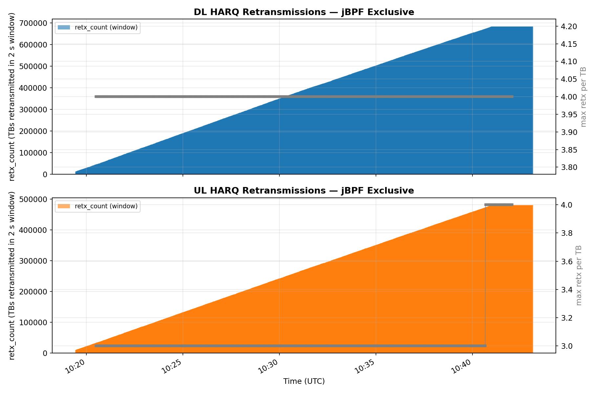

Per-2s-window retransmission count and maximum retransmission index for the DL and UL HARQ processes (`mac_harq_stats`). Two streams are tracked: the DL stream (avg_mcs ≈ 24.8) and the UL stream (avg_mcs ≈ 19.3). The UL stream shows substantially higher retransmission counts, consistent with the higher UL BLER (10.82% vs 0.86% DL). The maximum retransmission index reaching 3--4 indicates some TBs require the maximum number of HARQ rounds before decode. No standard equivalent at per-HARQ-process granularity.

### DL iperf3 packet quality

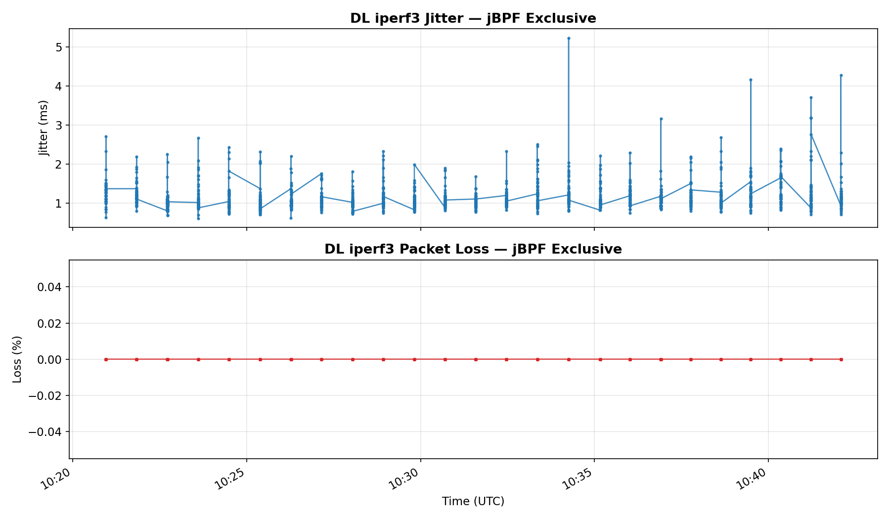

Application-layer jitter (ms) and packet loss (%) from the iperf3 DL receiver, captured by the `ue_dl_throughput` codelet. Jitter remains low (<5 ms) and packet loss is effectively zero throughout the run, confirming the DL path is stable despite the 10.82% UL BLER. No standard equivalent at the application layer.

### Per-slot SINR range

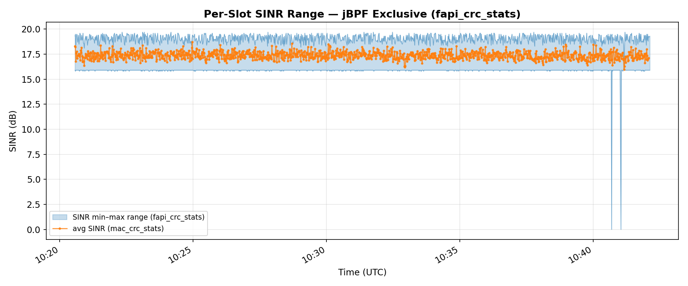

Instantaneous SINR minimum and maximum per 2 s window from `fapi_crc_stats` (converted from raw units × 0.1 dB), overlaid with the window-averaged SINR from `mac_crc_stats`. The shaded band shows that while the average stays around 17.4 dB, individual slots experience SINR as low as ~16 dB and as high as ~20 dB within the same window. The standard metrics server only exposes the average; the range information is only available through jBPF.

---

## 7. srsRAN Standard-exclusive metrics

The standard WebSocket interface exposes five measurement tables. Everything below is collected by Telegraf and stored in InfluxDB 3 but has no equivalent Janus codelet in the current deployment.

### 7.1 `ue` measurement -- per-UE, 1 Hz

**Radio quality (additional fields beyond the comparison set):**

| Field | Observed value (20-min run) | What it is |
|---|---|---|
| `pucch_snr_db` | 15.2 dB mean | SNR on the PUCCH control channel (separate receiver path from PUSCH) |
| `pusch_rsrp_db` | -99.9 dBm | PUSCH reference signal received power; -99.9 is the srsRAN sentinel for "not measurable" in ZMQ mode |
| `pucch_ta_ns` | 520.1 ns mean | Timing advance derived from PUCCH reception |
| `pusch_ta_ns` | 519.6 ns mean | Timing advance derived from PUSCH reception |

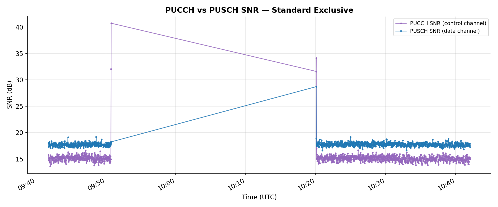

PUCCH SNR (~15.2 dB) is noticeably lower than PUSCH SNR (~17.7 dB) because PUCCH uses a narrowband format occupying only a few RBs at the cell edge, while PUSCH occupies a much wider allocation with frequency diversity. Both are stable across the run.

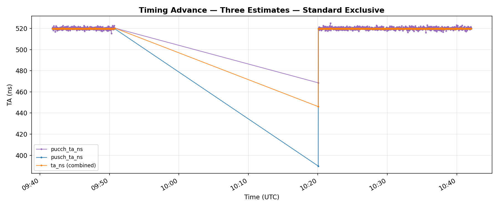

The three TA estimates (`pucch_ta_ns`, `pusch_ta_ns`, `ta_ns`) are all essentially constant at ~520 ns, confirming zero propagation-delay variation on the static ZMQ channel. Note: the comparison uses `ta_ns` (the combined/primary TA estimate), which tracks `pusch_ta_ns` closely. `pucch_ta_ns` is slightly higher because PUCCH and PUSCH use different receiver chains and timing references.

**MIMO rank indicator:**

| Field | Observed value | What it is |
|---|---|---|
| `dl_ri` | 1.0 (constant) | Downlink rank indicator -- number of spatial layers |
| `ul_ri` | 1.0 (constant) | Uplink rank indicator |

Both constant at 1 because the ZMQ channel is SISO (single antenna). In a MIMO deployment these would vary with channel rank.

**DL buffer status:**

| Field | What it is |
|---|---|
| `dl_bs` | Pending bytes in the DL scheduler queue for this UE (bytes) |

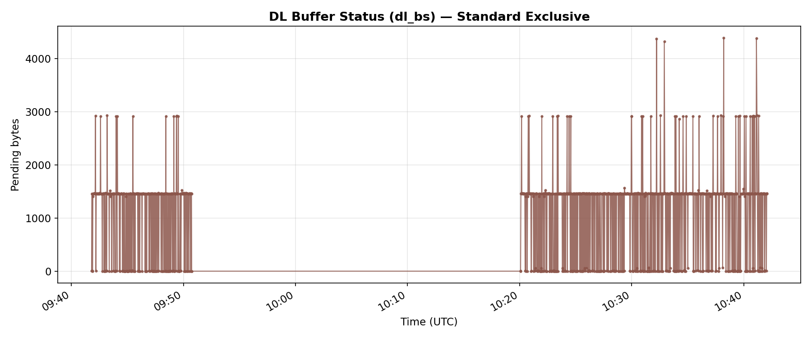

DL buffer status fluctuates with scheduler backlog. The periodic pattern reflects the iperf3 5 Mbps DL target being filled and drained by the scheduler every few milliseconds.

**HARQ processing delays:**

| Field | Observed value | What it is |
|---|---|---|
| `avg_crc_delay` | 3.0 slots | Average delay between PUSCH transmission and CRC decode result |
| `avg_pucch_harq_delay` | 3.0 slots | Average delay from DL transmission to HARQ ACK/NACK on PUCCH |
| `avg_pusch_harq_delay` | 3.0 slots | Average delay from UL grant to HARQ processing completion |
| `max_crc_delay` | 3.0 slots | Maximum CRC delay observed in the window |
| `max_pucch_harq_delay` | 3.0 slots | Maximum PUCCH HARQ delay |
| `max_pusch_harq_delay` | 3.0 slots | Maximum PUSCH HARQ delay |

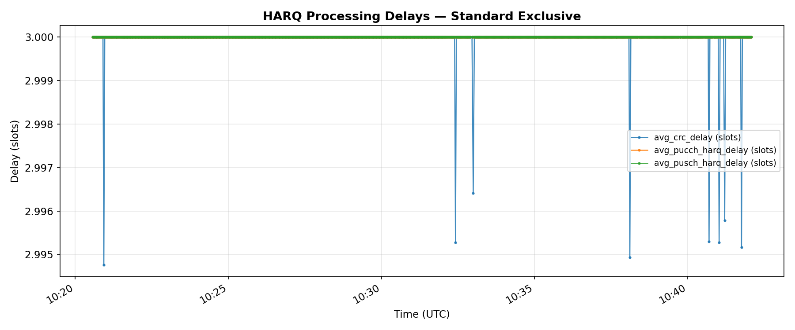

All constant at 3 slots (= 3 ms at 15 kHz SCS), which is the standard NR K2 timing offset. These would spike under CPU overload, providing an early warning signal before packet loss is visible.

**Invalid UCI events:**

| Field | Observed value | What it is |
|---|---|---|
| `nof_pucch_f0f1_invalid_harqs` | 0 | HARQ feedback received on PUCCH format 0/1 that could not be decoded |
| `nof_pucch_f2f3f4_invalid_harqs` | 0 | Same for PUCCH format 2/3/4 |
| `nof_pucch_f2f3f4_invalid_csis` | 0 | CSI reports on PUCCH format 2/3/4 that could not be decoded |
| `nof_pusch_invalid_harqs` | 0 | HARQ multiplexed on PUSCH that could not be decoded |
| `nof_pusch_invalid_csis` | 0 | CSI multiplexed on PUSCH that could not be decoded |

All zero in steady-state operation. Non-zero values indicate UCI decoding failures and may precede MCS drops.

### 7.2 `cell` measurement -- per-cell, 1 Hz

**Scheduler latency:**

| Field | Observed value | What it is |
|---|---|---|
| `average_latency` | 60.6 µs | Average time from TTI trigger to DL grant decision |
| `max_latency` | 301.2 µs | Maximum scheduler latency in the window |
| `latency_histogram_0` .. `_9` | ~438, ~466, ~122, ~35, ~9, ~4, ~1, 0, 0, 0 counts | Distribution of scheduling decisions across 10 latency bins |

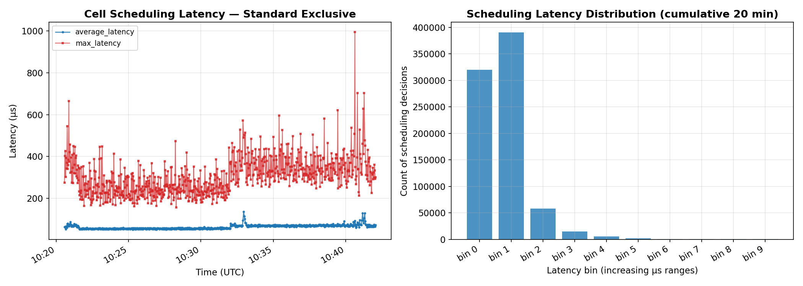

Left panel shows average and peak scheduling latency over time -- both well within the 1000 µs slot boundary throughout the run. Right panel shows the cumulative latency distribution: the vast majority of scheduling decisions complete in under 200 µs (bins 0--1). This is the cell-level view of the same scheduling process that Janus exposes at hook granularity in `jbpf_perf`.

**Late HARQ and allocation failures:**

| Field | Observed value | What it is |
|---|---|---|
| `late_dl_harqs` | 0 | DL HARQ feedback that arrived after the processing deadline |
| `late_ul_harqs` | 0 | UL HARQ retransmission decisions that missed their deadline |
| `nof_failed_pdcch_allocs` | 0 | PDCCH allocations that could not be scheduled (search space exhausted) |
| `nof_failed_uci_allocs` | 0 | UCI (HARQ/CSI/SR) that could not be allocated on PUCCH |

All zero in normal operation. Any non-zero count indicates scheduler overload or resource exhaustion.

**PRACH / random access:**

| Field | Observed value | What it is |
|---|---|---|
| `msg3_nof_ok` | ~0 (occasional attach) | Successful Msg3 RACH completions per second |
| `msg3_nof_nok` | 0 | Failed Msg3 RACH attempts |
| `avg_prach_delay` | -- (only present during RACH) | Average delay from preamble detection to Msg2 RAR transmission |

Near-zero in steady state; non-zero only during attach/detach events.

**PUCCH resource usage:**

| Field | Observed value | What it is |
|---|---|---|
| `pucch_tot_rb_usage_avg` | 0.36 RBs | Average PUCCH RB consumption per slot |

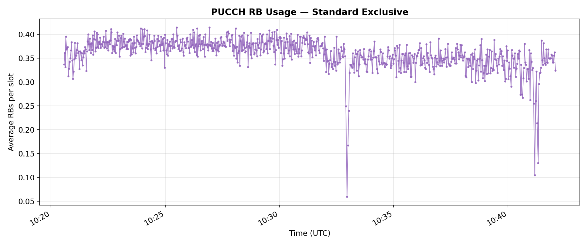

PUCCH RB usage averages 0.36 RBs per slot, consistent with one active UE sending periodic HARQ feedback and SR. Spikes correspond to UCI aggregation events where multiple feedback items arrive in the same slot.

**Error indications:**

| Field | Observed value | What it is |
|---|---|---|
| `error_indication_count` | 0 | F1AP error indications received from the DU |

### 7.3 `du` measurement -- DU High thread, 1 Hz

Reports the real-time behaviour of the MAC DL scheduling thread inside the Distributed Unit High layer.

| Field | Observed value | What it is |
|---|---|---|
| `du_high_mac_dl_0_average_latency_us` | 195 µs | Average time the DL MAC thread spends per TTI |
| `du_high_mac_dl_0_min_latency_us` | 29 µs | Minimum observed DL MAC thread latency |
| `du_high_mac_dl_0_max_latency_us` | 842 µs | Maximum observed DL MAC thread latency |
| `du_high_mac_dl_0_cpu_usage_percent` | 0.02% | CPU share consumed by the DL MAC thread |

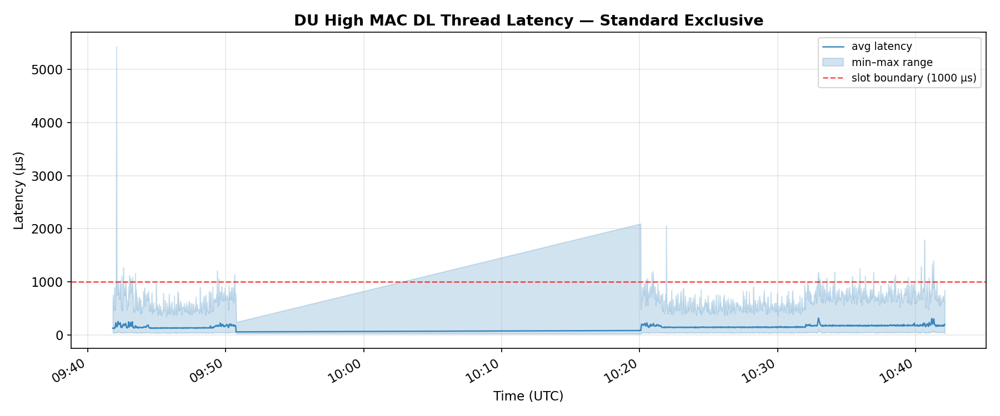

The DU High MAC DL thread averages 195 µs per TTI, well within the 1000 µs slot boundary (dashed red line). The max of 842 µs indicates occasional longer processing but never a deadline miss. This is a thread-level metric, whereas Janus's `jbpf_perf` reports function-level hook latency within that thread.

### 7.4 `cu-cp` measurement -- CU Control Plane, 1 Hz

Reports CU-CP state and mobility statistics.

| Field | Observed value | What it is |
|---|---|---|
| `rrcs_nof_handover_executions_requested` | 0 | X2/Xn handover executions initiated |
| `rrcs_nof_successful_handover_executions` | 0 | Successful handover completions |
| `ngaps_nof_handover_preparations_requested` | 0 | NG-based handover preparations initiated toward the AMF |
| `ngaps_nof_successful_handover_preparations` | 0 | Successful NG handover preparations |

All zero in a single-cell experiment. Non-zero in multi-cell or mobility test scenarios.

### 7.5 `event_list` measurement -- event-driven

Asynchronous UE state-change events emitted whenever the gNB transitions a UE through an RRC state.

| Field | What it is |
|---|---|
| `event_type` | Event name (e.g., `ue_reconf`, `ue_attach`, `ue_detach`) |
| `rnti` | RNTI of the UE that triggered the event |
| `slot` | System frame + slot number at which the event occurred |

Events seen in the 20-min run: two `ue_reconf` events (RRC reconfiguration during initial attach), no detach. Unlike the polled measurements above, these fire immediately when the event occurs rather than at the next 1 s boundary.

### 7.6 Direction asymmetry: UL vs DL BLER

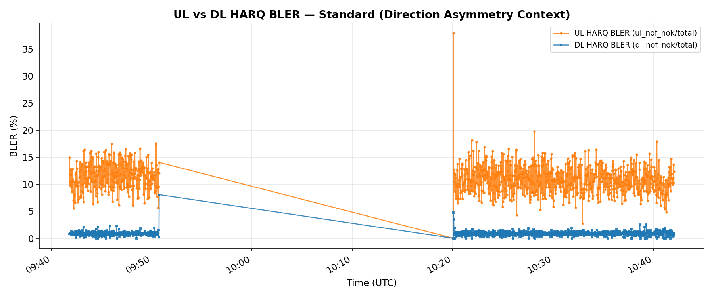

The standard interface is the only source that provides both UL and DL HARQ error rates. UL HARQ BLER (~10.82%) is substantially higher than DL HARQ BLER (~0.86%), confirming the asymmetric link budget: UE TX gain (50) vs gNB TX gain (75). Together with the jBPF UL CRC stats (plot 07), this gives a complete picture of both link directions.

---

## 8. Capability comparison

| | Standard | Janus |
|---|---|---|
| Setup effort | Low (Docker Compose) | High (jrtc, codelets, proxy, decoder) |
| Update rate | ~1 Hz (1 s aggregates) | ~1 Hz (configurable, per-slot possible) |
| Per-slot (1 ms) visibility | No | Yes |
| Hook execution latency | No | Yes (22 hooks) |
| Per-layer byte counters (RLC/PDCP) | No | Yes |
| RLC SDU delivery latency | No | Yes |
| Per-RACH-attempt SNR + TA | No | Yes |
| RRC/NGAP procedure timing | No | Yes |
| Infrastructure fault detection | No | Yes |
| PRB allocation min/max/avg | No | Yes (FAPI) |
| HARQ retx per process | No | Yes (mac_harq_stats) |
| App-layer jitter + packet loss | No | Yes (iperf3 codelets) |
| Per-slot SINR min/max range | No | Yes (fapi_crc_stats) |
| CQI / Rank Indicator | Yes | Partial (CQI yes, RI yes) |
| Scheduling latency histograms | Yes | No |
| DL buffer status / PHR | Yes | No |
| PUCCH SNR + TA | Yes | No |
| DU High thread latency | Yes | No |
| CU-CP handover / NGAP stats | Yes | No |
| UE state-change events | Yes | No |
| Metric count | ~50 fields across 5 tables | 60+ fields across 17 measurements |
| CPU overhead | Negligible | **< 0.6% of one core** (measured) |
| Can be loaded/unloaded at runtime | Always on | Yes (`jrtc-ctl`) |

---

## 9. Takeaway

Where both systems measure the same quantity, their **mean values agree closely across all 10 overlapping metrics**: SINR means differ by 2.1%, DL and UL MCS by 0.1%, UL BLER by 0.0%, BSR by 2.1%, and timing advance by 0.2%. CQI and RI match exactly (both constant at 15 and 1 respectively, though the former is a srsUE limitation). Throughput differs by ~1.75× between Janus (iperf3 application layer) and the standard system (MAC layer) -- a structural difference from protocol overhead, not a data quality issue. These results validate that the eBPF codelets are extracting correct values from the gNB's internal data structures.

The UL BLER comparison is particularly noteworthy: Janus's `mac_crc_stats` UL CRC failure rate (10.82%) matches the standard's `ul_nof_ok/ul_nof_nok` UL HARQ NACK rate (10.82%) to within 0.0% mean difference, with a per-sample correlation of r = 0.410. Both read from the same MAC HARQ state via different paths -- the eBPF hook at the `mac_crc_stats` function call site and the standard metrics server via the MAC layer API -- and they agree exactly.

Per-sample **time-series correlation** ranges from near-zero (r ≈ 0.02--0.06 for TA and BSR) to moderate (r = 0.37--0.45 for MCS and SINR, r = 0.41 for UL BLER). The moderate correlations are consistent with two systems that use different aggregation windows (1 s vs 2 s) independently sampling the same fading process. The weak correlations for BSR and TA reflect metrics that are either near-constant (TA) or bursty and timing-sensitive (BSR).

The two channels are complementary. Standard gives a low-overhead overview of radio-layer health across five measurement tables. Janus adds things the standard channel cannot provide:

1. **Hook latency** -- direct measurement of gNB internal processing time, the only way to distinguish infrastructure faults from channel degradation.
2. **Per-slot resolution** -- events shorter than 1 second get averaged away in the standard 1 s aggregate.
3. **Cross-layer tracing** -- a single event like a HARQ failure can be followed from the scheduler through RLC retransmission to PDCP delivery, all time-aligned.
4. **PRB allocation visibility** -- the standard exposes no PRB counts; Janus shows per-slot DL/UL allocation from the FAPI layer.
5. **Application-layer quality** -- iperf3 jitter and packet loss are invisible to the MAC-level standard metrics.

---

## 10. Reproduction

```bash
# Start Docker metrics stack (Telegraf + InfluxDB 3 + Grafana)
cd ~/Desktop/srsRAN_Project_jbpf/docker
docker compose -f docker-compose.yml -f docker-compose.metrics.yml \
  up telegraf influxdb grafana --build -d

# Run the comparison experiment
cd ~/Desktop/srsran-telemetry-pipeline/scripts
bash launch_mac_telemetry.sh --grc --fading --k-factor 1 --snr 18

# Wait ~10 minutes for steady-state, then extract and compare
python3 extract_and_compare.py

# Or run the live side-by-side comparison
python3 compare_jbpf_vs_standard.py

# Dashboards:
#   Janus:    http://localhost:3000
#   Standard: http://localhost:3300
```

---

## 11. Raw data

All extracted data and aligned time series are in the [`data/`](data/) directory as CSV files. The extraction and plotting script is [`scripts/extract_and_compare.py`](../../scripts/extract_and_compare.py).

**Plot inventory (26 total):**

| # | Filename | Type | Metric |
|---|---|---|---|
| 01 | `01_sinr_snr_comparison.png` | Comparison | SINR / PUSCH SNR |
| 02 | `02_cqi_comparison.png` | Comparison | CQI |
| 03 | `03_dl_mcs_comparison.png` | Comparison | DL MCS |
| 04 | `04_ul_mcs_comparison.png` | Comparison | UL MCS |
| 05 | `05_dl_throughput_comparison.png` | Comparison | DL Throughput |
| 06 | `06_ul_throughput_comparison.png` | Comparison | UL Throughput |
| 07 | `07_ul_bler_comparison.png` | Comparison | UL BLER (same direction) |
| 08 | `08_bsr_comparison.png` | Comparison | BSR |
| 09 | `09_ta_comparison.png` | Comparison | Timing Advance |
| 10 | `10_ri_comparison.png` | Comparison | Rank Indicator |
| 11 | `11_summary_bar_chart.png` | Summary | Mean values bar chart |
| 12 | `12_correlation_scatter.png` | Summary | Correlation scatter grid |
| 13 | `13_jbpf_hook_latency.png` | jBPF-only | Hook p50 latency per hook |
| 14 | `14_jbpf_rtt.png` | jBPF-only | Ping RTT |
| 15 | `15_jbpf_prb_allocation.png` | jBPF-only | DL/UL PRB allocation |
| 16 | `16_jbpf_harq_retx.png` | jBPF-only | HARQ retransmissions |
| 17 | `17_jbpf_dl_iperf_quality.png` | jBPF-only | DL jitter + packet loss |
| 18 | `18_jbpf_sinr_range.png` | jBPF-only | Per-slot SINR min/max range |
| 19 | `19_std_pucch_pusch_snr.png` | Std-only | PUCCH vs PUSCH SNR |
| 20 | `20_std_ta_channels.png` | Std-only | Three TA estimates |
| 21 | `21_std_dl_bs.png` | Std-only | DL buffer status |
| 22 | `22_std_harq_delays.png` | Std-only | HARQ processing delays |
| 23 | `23_std_scheduling_latency.png` | Std-only | Cell scheduling latency + histogram |
| 24 | `24_std_pucch_rb_usage.png` | Std-only | PUCCH RB usage |
| 25 | `25_std_du_latency.png` | Std-only | DU High thread latency |
| 26 | `26_std_bler_both_directions.png` | Std-only | UL + DL HARQ BLER |
